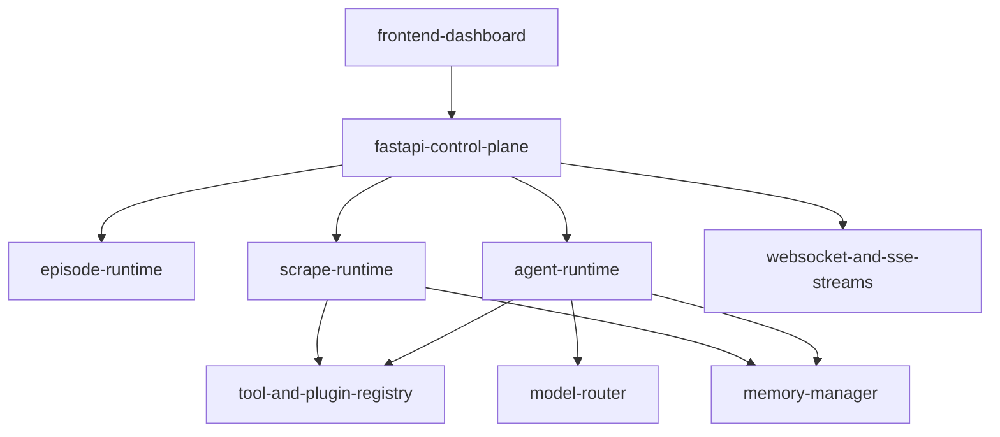

# scraperl

ScrapeRL is an AI-first web-scraping platform that combines reinforcement-learning style episodes, multi-agent planning, dynamic tool/plugin calls, and multi-provider LLM routing. It supports synchronous and streaming scrape APIs, session-based execution, real-time frontend updates, and OpenEnv-compatible inference.

## what-this-project-delivers

| area | capability |
| --- | --- |
| scraping-runtime | endpoint-driven scraping with `json`, `csv`, `markdown`, and `text` output modes |
| ai-routing | provider/model routing across OpenAI, Anthropic, Google, Groq, and NVIDIA |
| agentic-tooling | registry-based runtime tool planning and execution with streamed `tool_call` steps |
| memory | short-term, working, long-term, and shared memory layers |
| interface | React + Vite dashboard with live stream progress and session visibility |
| deployment | local dev, Docker Compose, and Hugging Face Space-compatible Docker setup |
| evaluation | root `inference.py` following strict `[START]/[STEP]/[END]` OpenEnv output contract |

## system-topology



## repository-layout

```text
scrapeRL/
  backend/
    app/
      api/routes/        # FastAPI route modules
      agents/            # agent planning/runtime logic
      models/            # model router + provider adapters
      plugins/           # plugin registry + runtime integrations
      memory/            # memory layers and manager
      core/              # env/reward/observation/action foundations
    requirements.txt
  frontend/
    src/                 # React app
    package.json
  docs/                  # modular technical documentation
  inference.py           # OpenEnv-compliant inference runner
  docker-compose.yml
  .env.example
```

## quick-start

### docker-compose

```bash
git clone https://github.com/NeerajCodz/scrapeRL.git
cd scrapeRL
cp .env.example .env
# set api keys in .env
docker compose up --build
```

| service | url |
| --- | --- |
| frontend | `http://localhost:3000` |
| backend-api | `http://localhost:8000` |
| swagger | `http://localhost:8000/swagger` |

### local-development

Backend:

```bash
cd backend
pip install -r requirements.txt
uvicorn app.main:app --reload --host 0.0.0.0 --port 8000
```

Frontend:

```bash
cd frontend
npm install
npm run dev -- --host 0.0.0.0 --port 3000
```

## configuration

Root configuration lives in `.env` (template: `.env.example`).

### provider-and-model-keys

| variable | purpose |
| --- | --- |
| `OPENAI_API_KEY` | OpenAI chat + embeddings access |
| `ANTHROPIC_API_KEY` | Anthropic model access |
| `GOOGLE_API_KEY` | Google provider and embeddings access |
| `GEMINI_API_KEY` | alias key used by tests/compose for Gemini |
| `GROQ_API_KEY` | Groq provider access |
| `NVIDIA_API_KEY` | NVIDIA provider access |
| `NVIDIA_BASE_URL` | NVIDIA OpenAI-compatible endpoint base URL |
| `GEMINI_MODEL_EMBEDDING` | embedding model id for Google embeddings |
| `HF_TOKEN` | required token for `inference.py` OpenAI client auth |

### app-runtime

| variable | default |
| --- | --- |
| `DEBUG` | `false` |
| `LOG_LEVEL` | `INFO` |
| `HOST` | `0.0.0.0` |
| `PORT` | `8000` |
| `CORS_ORIGINS` | `["http://localhost:5173","http://localhost:3000"]` |
| `SESSION_TIMEOUT` | `3600` |
| `MEMORY_TTL` | `86400` |

### inference-runtime

| variable | default |
| --- | --- |
| `API_BASE_URL` | `https://api.openai.com/v1` |
| `MODEL_NAME` | `gpt-4.1-mini` |
| `ENV_API_BASE_URL` | `http://localhost:8000/api` |
| `TASK_NAME` | `task_001` |
| `BENCHMARK` | `openenv` |
| `MAX_STEPS` | `12` |
| `EPISODE_SEED` | `42` |
| `LLM_TEMPERATURE` | `0.0` |
| `PROMPT_HTML_LIMIT` | `5000` |
| `REQUEST_TIMEOUT_SECONDS` | `30` |
| `USE_OPENENV_SDK` | `true` |

## inferencepy-openenv-contract

The root `inference.py` uses `from openai import OpenAI` for all LLM calls and emits strict structured logs:

```text
[START] task=<task_name> env=<benchmark> model=<model_name>
[STEP] step=<n> action=<action_str> reward=<0.00> done=<true|false> error=<msg|null>
[END] success=<true|false> steps=<n> rewards=<r1,r2,...,rn>
```

Run:

```bash
python inference.py --task task_001 --benchmark openenv
```

## api-quick-map

Use `docs/api-reference.md` for the full endpoint inventory. Core surfaces:

| surface | endpoints |
| --- | --- |
| health | `/api/health`, `/api/ready`, `/api/ping` |
| episode | `/api/episode/reset`, `/api/episode/step`, `/api/episode/state/{episode_id}` |
| scrape | `/api/scrape/stream`, `/api/scrape/{session_id}/status`, `/api/scrape/{session_id}/result` |
| agents-tools-memory | `/api/agents/*`, `/api/tools/*`, `/api/plugins/*`, `/api/memory/*` |
| realtime | `/ws/episode/{episode_id}` |

## documentation-map

| document | purpose |
| --- | --- |
| `docs/overview.md` | platform overview and navigation |
| `docs/api-reference.md` | authoritative HTTP and WebSocket reference |
| `docs/architecture.md` | system architecture and runtime planes |
| `docs/openenv.md` | OpenEnv environment contract |
| `docs/tool-calls.md` | streamed tool-call event patterns |
| `docs/plugins.md` | plugin registry and dynamic tool model |
| `docs/memory.md` | memory design and operations |
| `docs/readme.md` | docs index |

## testing-and-validation

Backend:

```bash
cd backend
pytest
```

Frontend:

```bash
cd frontend
npm run test
```

## deployment-notes

| mode | notes |
| --- | --- |
| docker-compose | preferred local full-stack run |
| hugging-face-space | root `README.md` front matter + Docker SDK config is compatible |
| direct-backend | run `uvicorn app.main:app` with `.env` configured |

## troubleshooting

| symptom | likely-cause | check |
| --- | --- | --- |
| provider not available | missing api key | verify `.env` provider key |
| streaming has no step events | scrape runtime failed early | inspect `/api/scrape/{session_id}/status` |
| inference exits with failure | missing `HF_TOKEN` or endpoint mismatch | verify `HF_TOKEN`, `API_BASE_URL`, `MODEL_NAME` |
| no frontend data | backend not reachable from frontend | check `VITE_API_PROXY_TARGET` / backend health |

## license

MIT.

