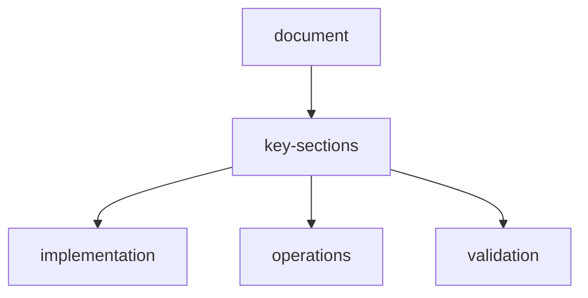

# documentation-index

This documentation set supersedes and expands `webscraper-openenv-softwaredoc.md` into focused modules.

## core-docs

- `overview.md` — top-level platform overview and documentation navigation
- `openenv.md` — enhanced OpenEnv spec, actions, observations, lifecycle
- `architecture.md` — system architecture, runtime, scheduling, scaling
- `agents.md` — multi-agent roles, strategies, HITL, explainability
- `rewards.md` — advanced reward function and signal breakdown

## platform-docs

- `api-reference.md` — complete HTTP and WebSocket endpoint reference
- `api.md` — multi-model API system and routing/ensemble/cost tracking
- `mcp.md` — MCP integration, registry, lazy install, composition
- `plugins.md` — plugin registry model, category matrix, runtime selection flow
- `search-engine.md` — search providers, query optimization, credibility scoring
- `html-processing.md` — semantic parsing, adaptive chunking, batch + diff processing
- `memory.md` — unified memory system (short/working/long/shared)
- `tool-calls.md` — step event contract and runtime tool-call payload patterns

## operations-docs

- `settings.md` — dashboard settings and configuration controls
- `observability.md` — metrics, traces, thought stream, cost telemetry
- `features.md` — advanced capabilities and feature flags

## legacy

- `webscraper-openenv-softwaredoc.md` remains as original monolithic source.

## document-metadata

| key | value |
| --- | --- |
| document | `readme.md` |
| status | active |

## document-flow

