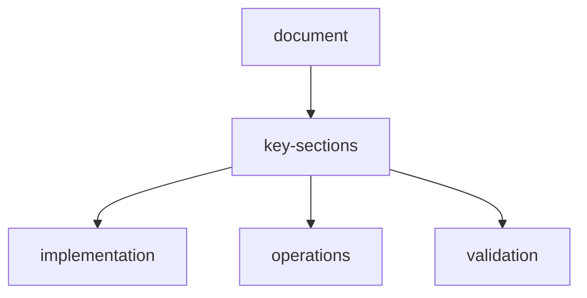

# agents-system-design

## overview

The agent runtime is a multi-agent, memory-aware RL orchestration layer for web extraction tasks. It supports:

- Single-agent and multi-agent execution modes
- Strategy selection (`search-first`, `direct-extraction`, `multi-hop-reasoning`)
- Human-in-the-loop intervention
- Explainable decision traces
- Self-improvement from past episodes

## agent-roles

### 1-planner-agent

Builds a plan before action:

- Goal decomposition
- Tool selection plan
- Risk and fallback path

### 2-navigator-agent

Explores pages and search results:

- URL prioritization
- Link traversal policy
- Page relevance scoring
- Site-template lookup (`/api/sites/match`) for domain-specific guidance

### 3-extractor-agent

Extracts structured fields:

- Selector and schema inference
- Adaptive chunk extraction
- Long-page batch processing

### 4-verifier-agent

Checks consistency and trust:

- Cross-source verification
- Conflict resolution
- Confidence calibration

### 5-memory-agent

Manages memory write/read/search:

- Episode summaries
- Pattern persistence
- Retrieval ranking and pruning

## execution-modes

### single-agent

One policy handles all actions.

Pros: low overhead, simple.
Cons: weaker specialization.

### multi-agent

Coordinator delegates work:

1. Planner emits execution graph
2. Navigator discovers candidate pages and loads site templates
3. Extractor parses and emits data
4. Verifier validates outputs
5. Memory Agent stores reusable patterns

## site-template-awareness

Agents can reference inbuilt templates from `backend/app/sites/`:

- Planner resolves template context early (site id, strategy, output fields)
- Navigator refreshes template context per URL
- Execution steps include template provenance (`site_template` action)

Pros: modular, robust, scalable.
Cons: coordination overhead.

## agent-communication

Shared channels:

- `agent_messages`: async inter-agent messages
- `task_state`: current objective and progress
- `global_knowledge`: reusable facts and patterns

Message schema:

```json
{
  "message_id": "msg_123",
  "from": "navigator",
  "to": "extractor",
  "type": "page_candidate",
  "payload": {
    "url": "https://site.com/p/123",
    "relevance": 0.91
  },
  "timestamp": "2026-03-27T00:00:00Z"
}
```

## decision-policy

Policy input includes:

- Observation
- Working memory context
- Retrieved long-term memory hits
- Tool registry availability
- Budget and constraints

Policy output includes:

- Next action
- Confidence
- Rationale
- Fallback action (optional)

## strategy-library

Built-in strategy templates:

- `search-first`: broad discovery then narrow extraction
- `direct-extraction`: immediate field extraction from target page
- `multi-hop-reasoning`: iterative search and verification
- `table-centric`: table-first parsing
- `form-centric`: forms and input structures prioritized

Strategy selection can be:

- Manual (user setting)
- Automatic (router based on task signature)

## self-improving-agent-loop

After each episode:

1. Compute reward breakdown
2. Extract failed and successful patterns
3. Update strategy performance table
4. Store high-confidence selectors in long-term memory
5. Penalize redundant navigation patterns

## explainable-ai-mode

Each action can emit:

- Why this action was chosen
- Why alternatives were rejected
- Which memory/tool evidence was used

Example trace:

```text
Action: EXTRACT_FIELD(price)
Why: Pattern "span.product-price" had 0.93 historical confidence on similar domains.
Alternatives rejected: ".price-box .value" (lower confidence 0.58), regex-only extraction (unstable on this layout).
```

## human-in-the-loop

Optional checkpoints:

- Approve/reject planned action
- Override selector/tool/model
- Force verification before submit

Intervention modes:

- `off`: fully autonomous
- `review`: pause on low-confidence steps
- `strict`: require approval on all submit/fetch/verify actions

## scenario-simulator-hooks

Agents can be tested against:

- Noisy HTML
- Missing fields
- Broken pagination
- Adversarial layouts
- Dynamic content with delayed rendering

Simulation metrics:

- Completion
- Recovery score
- Generalization score
- Cost and latency

## apis

- `POST /api/agents/run`
- `POST /api/agents/plan`
- `POST /api/agents/override`
- `GET /api/agents/state/{episode_id}`
- `GET /api/agents/trace/{episode_id}`

## dashboard-widgets

- Live thought stream
- Agent role timeline
- Inter-agent message feed
- Strategy performance chart
- Confidence and override panel


## related-api-reference

| item | value |
| --- | --- |
| api-reference | `api-reference.md` |

## document-metadata

| key | value |
| --- | --- |
| document | `agents.md` |
| status | active |

## document-flow


