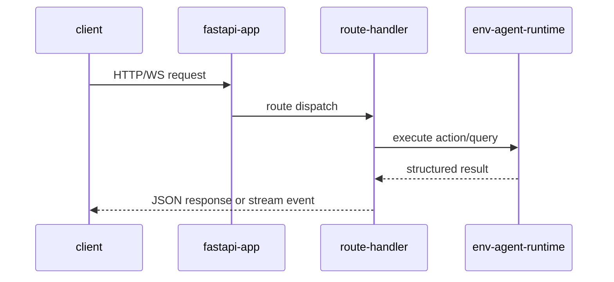

# api-reference

## overview

This is the operational HTTP and WebSocket reference for the running FastAPI app in `backend/app/main.py`.

## base-contract

| item | value |
| --- | --- |
| base-prefix | `/api` |
| swagger-ui | `/swagger` |
| redoc | `/redoc` |
| openapi-json | `/openapi.json` |
| websocket-prefix | `/ws` |

## route-groups

| group | prefix | canonical-purpose |
| --- | --- | --- |
| health | `/api` | liveness/readiness checks |
| episode | `/api/episode` | reset/step/state lifecycle |
| tasks | `/api/tasks` | task catalog and creation |
| agents | `/api/agents` | agent listing/execution/plan/install |
| tools | `/api/tools` | tool registry and tool testing |
| memory | `/api/memory` | store/query/update/clear memory entries |
| settings | `/api/settings` | api-key and model preferences |
| plugins | `/api/plugins` | plugin install/uninstall and tool catalog |
| sites | `/api/sites` | template listing/matching |
| scrape | `/api/scrape` | scrape execution and session result APIs |
| providers | `/api/providers` | provider/model metadata and cost summary |
| websocket | `/ws` | real-time episode stream |

## health-endpoints

| method | path | description |
| --- | --- | --- |
| `GET` | `/api/health` | liveness check |
| `GET` | `/api/ready` | readiness/dependency check |
| `GET` | `/api/ping` | lightweight ping |

## episode-endpoints

| method | path | description |
| --- | --- | --- |
| `POST` | `/api/episode/reset` | create episode and return initial observation |
| `POST` | `/api/episode/step` | apply one action and return transition |
| `GET` | `/api/episode/state/{episode_id}` | current episode snapshot |
| `GET` | `/api/episode/` | list active/recent episodes |
| `DELETE` | `/api/episode/{episode_id}` | delete episode state |

## task-endpoints

| method | path | description |
| --- | --- | --- |
| `GET` | `/api/tasks/` | list available tasks |
| `GET` | `/api/tasks/{task_id}` | fetch one task |
| `POST` | `/api/tasks/` | create dynamic task |
| `GET` | `/api/tasks/types/` | list task-type catalog |

## agent-endpoints

| method | path | description |
| --- | --- | --- |
| `GET` | `/api/agents/list` | list available agents |
| `POST` | `/api/agents/run` | run one agent request |
| `POST` | `/api/agents/plan` | request generated plan |
| `GET` | `/api/agents/state/{agent_id}` | fetch one agent state |
| `GET` | `/api/agents/types/` | list agent types |
| `GET` | `/api/agents/catalog` | full agent catalog |
| `GET` | `/api/agents/installed` | installed agents |
| `POST` | `/api/agents/install` | install agent |
| `POST` | `/api/agents/uninstall` | uninstall agent |
| `POST` | `/api/agents/message` | send message to running agent |

## tool-and-plugin-endpoints

### tools

| method | path | description |
| --- | --- | --- |
| `GET` | `/api/tools/registry` | list tools in registry |
| `GET` | `/api/tools/registry/{tool_name}` | tool metadata/details |
| `POST` | `/api/tools/test` | execute tool test run |
| `GET` | `/api/tools/categories` | tool category summary |

### plugins

| method | path | description |
| --- | --- | --- |
| `GET` | `/api/plugins` | list plugins (alias without trailing slash also available) |
| `GET` | `/api/plugins/installed` | list installed plugins |
| `GET` | `/api/plugins/categories` | category summary |
| `GET` | `/api/plugins/tools` | list plugin tools |
| `GET` | `/api/plugins/tools/{tool_name:path}` | tool details |
| `GET` | `/api/plugins/registry` | registry endpoint |
| `GET` | `/api/plugins/summary` | compact plugin summary |
| `GET` | `/api/plugins/{plugin_id}` | single plugin by id |
| `POST` | `/api/plugins/install` | install plugin |
| `POST` | `/api/plugins/uninstall` | uninstall plugin |

## memory-endpoints

| method | path | description |
| --- | --- | --- |
| `POST` | `/api/memory/store` | create memory entry |
| `POST` | `/api/memory/query` | semantic/filter query |
| `GET` | `/api/memory/{entry_id}` | read one entry |
| `PUT` | `/api/memory/{entry_id}` | update one entry |
| `DELETE` | `/api/memory/{entry_id}` | delete one entry |
| `GET` | `/api/memory/stats/overview` | memory layer stats |
| `DELETE` | `/api/memory/clear/{memory_type}` | clear one layer |
| `POST` | `/api/memory/consolidate` | memory consolidation |

## settings-provider-and-sites-endpoints

### settings

| method | path | description |
| --- | --- | --- |
| `GET` | `/api/settings` | get settings (alias with trailing slash also available) |
| `POST` | `/api/settings/api-key` | update runtime api-key |
| `POST` | `/api/settings/model` | set active model |
| `GET` | `/api/settings/api-key/required` | whether key is required |

### providers

| method | path | description |
| --- | --- | --- |
| `GET` | `/api/providers` | list providers (alias with trailing slash also available) |
| `GET` | `/api/providers/{provider_name}` | provider details |
| `GET` | `/api/providers/models/all` | flattened model list |
| `GET` | `/api/providers/costs/summary` | token/cost summary |
| `POST` | `/api/providers/costs/reset` | reset provider cost tracking |

### sites

| method | path | description |
| --- | --- | --- |
| `GET` | `/api/sites` | list built-in templates |
| `GET` | `/api/sites/{site_id}` | template detail |
| `POST` | `/api/sites/match` | infer matching template |

## scrape-endpoints

| method | path | description |
| --- | --- | --- |
| `POST` | `/api/scrape/stream` | streaming scrape run (`text/event-stream`) |
| `POST` | `/api/scrape/` | synchronous scrape request |
| `GET` | `/api/scrape/sessions` | list scrape sessions |
| `GET` | `/api/scrape/{session_id}/status` | status for one session |
| `GET` | `/api/scrape/{session_id}/result` | final result payload |
| `GET` | `/api/scrape/{session_id}/sandbox/files` | list sandbox artifacts |
| `GET` | `/api/scrape/{session_id}/sandbox/files/{file_name}` | fetch one artifact |
| `DELETE` | `/api/scrape/{session_id}` | cancel active session |
| `DELETE` | `/api/scrape/{session_id}/cleanup` | cleanup artifacts/session cache |

## websocket-endpoint

| protocol | path | description |
| --- | --- | --- |
| `ws` | `/ws/episode/{episode_id}` | real-time episode event stream |

## scrape-stream-event-shape

| field | type | notes |
| --- | --- | --- |
| `type` | string | `init`, `step`, `url_start`, `url_complete`, `complete`, `error` |
| `data` | object | event payload |
| `data.action` | string | step action (`tool_call`, `agent_decision`, etc.) |
| `data.status` | string | runtime status |
| `data.extracted_data` | object/null | structured output for the step |

## request-flow

## error-model

| status-code | meaning |
| --- | --- |
| `400` | invalid request payload or unsupported operation |
| `404` | resource not found (`episode_id`, `session_id`, `entry_id`) |
| `422` | validation error (FastAPI schema mismatch) |
| `500` | uncaught server/runtime error |

## document-metadata

| key | value |
| --- | --- |
| document | `api-reference.md` |
| source | `backend/app/main.py` route graph |
| status | active |

