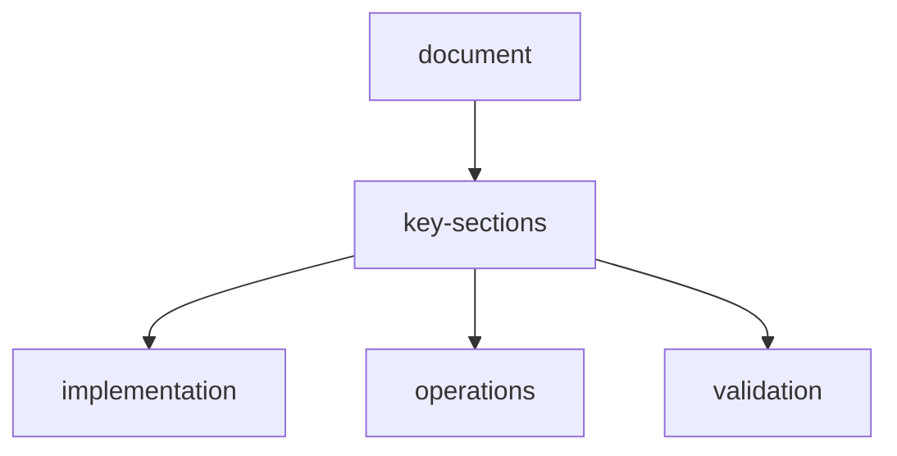

# multi-model-api-system

## table-of-contents
1. [Overview](#overview)
2. [Supported Providers](#supported-providers)
3. [Smart Model Router](#smart-model-router)
4. [Model Ensemble](#model-ensemble)
5. [Cost & Token Tracking](#cost--token-tracking)
6. [Prompt Management](#prompt-management)
7. [Configuration](#configuration)
8. [API Reference](#api-reference)

---

## overview

The **Multi-Model API System** provides a unified interface for interacting with multiple LLM providers (OpenAI, Anthropic, Google, Groq, etc.), enabling:

- **Flexibility:** Switch between models without code changes
- **Optimization:** Auto-route requests to the best model for each task
- **Cost Control:** Track spending and enforce budgets
- **Reliability:** Fallback to alternative models on failure
- **Experimentation:** A/B test prompts and models

## related-api-reference

| area | reference |
| --- | --- |
| http-websocket-endpoints | `api-reference.md` |
| openenv-runtime-contract | `openenv.md` |
| architecture-placement | `architecture.md` |

### architecture

```
┌────────────────────────────────────────────────────────────────┐
│                     Agent Request                               │
│              "Extract product price"                            │
└────────────────────────┬───────────────────────────────────────┘
                         │
                         ▼
┌────────────────────────────────────────────────────────────────┐
│                  Smart Model Router                             │
│  ┌──────────────────────────────────────────────────────────┐  │
│  │  Task Classifier:                                         │  │
│  │    • Reasoning → GPT-4 / Claude                           │  │
│  │    • Fast extraction → Groq / Gemini Flash                │  │
│  │    • Long context → Claude / GPT-4-32k                    │  │
│  │    • Cost-sensitive → Gemini / Groq                       │  │
│  └──────────────────────────────────────────────────────────┘  │
└────────────────────────┬───────────────────────────────────────┘
                         │
         ┌───────────────┼───────────────┬───────────────┐
         │               │               │               │
         ▼               ▼               ▼               ▼
┌─────────────┐  ┌─────────────┐ ┌─────────────┐ ┌─────────────┐
│   OpenAI    │  │  Anthropic  │ │   Google    │ │    Groq     │
│   Adapter   │  │   Adapter   │ │   Adapter   │ │   Adapter   │
└──────┬──────┘  └──────┬──────┘ └──────┬──────┘ └──────┬──────┘
       │                │                │                │
       ▼                ▼                ▼                ▼
┌─────────────┐  ┌─────────────┐ ┌─────────────┐ ┌─────────────┐
│ gpt-4-turbo │  │ claude-3.5  │ │ gemini-pro  │ │ llama-3-70b │
│ gpt-4o-mini │  │ claude-3    │ │ gemini-flash│ │ mixtral-8x7b│
└─────────────┘  └─────────────┘ └─────────────┘ └─────────────┘
```

---

## supported-providers

### 1-openai

**Models:**
- `gpt-4-turbo` - Best reasoning, multimodal
- `gpt-4o` - Fast GPT-4 variant
- `gpt-4o-mini` - Cost-effective, fast
- `gpt-3.5-turbo` - Legacy, cheap

**Capabilities:**
- Function calling
- JSON mode
- Vision (gpt-4-turbo, gpt-4o)
- 128k context (gpt-4-turbo)

**Configuration:**
```python
{
    "provider": "openai",
    "api_key": "sk-...",
    "organization": "org-...",  # Optional
    "models": {
        "default": "gpt-4o-mini",
        "reasoning": "gpt-4-turbo",
        "fast": "gpt-4o-mini"
    },
    "parameters": {
        "temperature": 0.7,
        "max_tokens": 4096,
        "timeout": 60
    }
}
```

### 2-anthropic-claude

**Models:**
- `claude-3-opus-20240229` - Most capable
- `claude-3-sonnet-20240229` - Balanced
- `claude-3-haiku-20240307` - Fast and cheap
- `claude-3-5-sonnet-20240620` - Latest, best

**Capabilities:**
- 200k context window
- Strong reasoning
- Excellent instruction following
- Tool use (function calling)

**Configuration:**
```python
{
    "provider": "anthropic",
    "api_key": "sk-ant-...",
    "models": {
        "default": "claude-3-5-sonnet-20240620",
        "reasoning": "claude-3-opus-20240229",
        "fast": "claude-3-haiku-20240307"
    },
    "parameters": {
        "temperature": 0.7,
        "max_tokens": 4096,
        "timeout": 90
    }
}
```

### 3-google-gemini

**Models:**
- `gemini-1.5-pro` - Best quality, 2M context
- `gemini-1.5-flash` - Fast, 1M context
- `gemini-1.0-pro` - Legacy

**Capabilities:**
- Massive context (1M-2M tokens)
- Multimodal (text, image, video, audio)
- Extremely cost-effective
- Function calling

**Configuration:**
```python
{
    "provider": "google",
    "api_key": "AIza...",
    "models": {
        "default": "gemini-1.5-flash",
        "reasoning": "gemini-1.5-pro",
        "fast": "gemini-1.5-flash"
    },
    "parameters": {
        "temperature": 0.7,
        "max_output_tokens": 8192,
        "timeout": 60
    }
}
```

### 4-groq

**Models:**
- `llama-3.1-405b` - Largest Llama
- `llama-3.1-70b-versatile` - Balanced
- `llama-3.1-8b-instant` - Ultra-fast
- `mixtral-8x7b-32768` - Good reasoning

**Capabilities:**
- **Extremely fast inference** (500+ tokens/sec)
- Free tier available
- Open-source models
- JSON mode

**Configuration:**
```python
{
    "provider": "groq",
    "api_key": "gsk_...",
    "models": {
        "default": "llama-3.1-70b-versatile",
        "reasoning": "llama-3.1-405b",
        "fast": "llama-3.1-8b-instant"
    },
    "parameters": {
        "temperature": 0.7,
        "max_tokens": 8192,
        "timeout": 30
    }
}
```

### 5-mistral-ai

**Models:**
- `mistral-large-latest` - Best quality
- `mistral-medium-latest` - Balanced
- `mistral-small-latest` - Fast and cheap
- `mixtral-8x22b` - Open-source, strong

**Configuration:**
```python
{
    "provider": "mistral",
    "api_key": "...",
    "models": {
        "default": "mistral-medium-latest",
        "reasoning": "mistral-large-latest",
        "fast": "mistral-small-latest"
    }
}
```

### 6-cohere

**Models:**
- `command-r-plus` - Best for RAG
- `command-r` - Balanced
- `command-light` - Fast

**Specialization:** RAG, embeddings, reranking

### 7-perplexity

**Models:**
- `pplx-70b-online` - Web-connected
- `pplx-7b-online` - Fast, web-connected

**Specialization:** Real-time web search and citations

### 8-together-ai

**Models:** 50+ open-source models
- Llama variants
- Mistral variants
- Code models (CodeLlama, StarCoder)

**Use Case:** Access to latest open-source models

### 9-custom-self-hosted

**Supported:**
- **Ollama** (local models)
- **vLLM** (self-hosted inference)
- **LM Studio** (local GUI)
- **LocalAI** (OpenAI-compatible local server)

**Configuration:**
```python
{
    "provider": "custom",
    "base_url": "http://localhost:11434/v1",  # Ollama
    "api_key": "not-needed",
    "models": {
        "default": "llama3:70b",
        "fast": "llama3:8b"
    }
}
```

---

## smart-model-router

The **Smart Model Router** automatically selects the best model for each request based on task characteristics.

### routing-strategy

```python
class ModelRouter:
    def route(self, task: Task, context: Dict) -> ModelConfig:
        """Select the best model for this task."""
        
        # 1. Explicit user preference
        if context.get("preferred_model"):
            return self.get_model(context["preferred_model"])
        
        # 2. Task-based routing
        if task.type == "reasoning":
            return self.route_reasoning(task, context)
        elif task.type == "extraction":
            return self.route_extraction(task, context)
        elif task.type == "classification":
            return self.route_classification(task, context)
        
        # 3. Fallback to default
        return self.default_model
    
    def route_reasoning(self, task: Task, context: Dict) -> ModelConfig:
        """Route complex reasoning tasks."""
        # Long context? Use Claude or Gemini
        if context.get("input_tokens", 0) > 50000:
            return self.get_model("claude-3-5-sonnet")  # 200k context
        
        # Need reliability? Use GPT-4 or Claude
        if task.importance == "high":
            return self.get_model("gpt-4-turbo")
        
        # Cost-sensitive? Use Gemini or Groq
        if context.get("budget_mode"):
            return self.get_model("gemini-1.5-flash")
        
        return self.get_model("claude-3-5-sonnet")  # Default for reasoning
    
    def route_extraction(self, task: Task, context: Dict) -> ModelConfig:
        """Route simple extraction tasks."""
        # Speed critical? Use Groq
        if context.get("latency_critical"):
            return self.get_model("llama-3.1-70b-versatile", provider="groq")
        
        # Cost-sensitive? Use Gemini Flash or Groq
        return self.get_model("gemini-1.5-flash")
```

### routing-rules

| Task Type | Input Size | Priority | Recommended Model | Reason |
|-----------|-----------|----------|-------------------|--------|
| Reasoning | Any | High | `gpt-4-turbo` | Best quality |
| Reasoning | >50k tokens | Any | `claude-3-5-sonnet` | 200k context |
| Reasoning | Any | Budget | `gemini-1.5-flash` | Cheap, good quality |
| Extraction | <10k tokens | Speed | `groq/llama-3.1-70b` | 500+ tok/sec |
| Extraction | Any | Budget | `gpt-4o-mini` | $0.15/1M tokens |
| Classification | <5k tokens | Any | `groq/llama-3.1-8b` | Ultra-fast |
| Long Context | >100k tokens | Any | `gemini-1.5-pro` | 2M context |
| Vision | Images | Any | `gpt-4o` | Best multimodal |
| Web Search | Any | Any | `perplexity` | Web-connected |

### configuration

```python
class RouterConfig(BaseModel):
    enabled: bool = True
    strategy: Literal["task_based", "cost_optimized", "speed_optimized", "quality_optimized"]
    
    # Task-based routing rules
    routing_rules: Dict[str, str] = {
        "reasoning_high_priority": "gpt-4-turbo",
        "reasoning_budget": "gemini-1.5-flash",
        "extraction_fast": "groq/llama-3.1-70b",
        "extraction_accurate": "claude-3-5-sonnet",
        "long_context": "gemini-1.5-pro",
        "vision": "gpt-4o"
    }
    
    # Fallback chain
    fallback_order: List[str] = [
        "claude-3-5-sonnet",
        "gpt-4o-mini",
        "gemini-1.5-flash",
        "groq/llama-3.1-70b"
    ]
    
    # Auto-retry on failure
    auto_retry: bool = True
    max_retries: int = 3
```

---

## model-ensemble

**Model Ensemble** runs multiple models in parallel and merges their outputs for higher quality or consensus.

### ensemble-strategies

#### 1-voting-classification-extraction

Run 3+ models, take majority vote.

```python
class VotingEnsemble:
    async def predict(self, prompt: str, models: List[str]) -> Any:
        """Run multiple models and vote on result."""
        tasks = [self.call_model(model, prompt) for model in models]
        results = await asyncio.gather(*tasks)
        
        # Count votes
        from collections import Counter
        votes = Counter(results)
        winner, count = votes.most_common(1)[0]
        
        confidence = count / len(results)
        return {
            "result": winner,
            "confidence": confidence,
            "votes": dict(votes)
        }

# Example: Extract price with 3 models
ensemble = VotingEnsemble()
result = await ensemble.predict(
    prompt="Extract the product price: <html>...",
    models=["gpt-4o-mini", "gemini-1.5-flash", "groq/llama-3.1-70b"]
)
# Result: {"result": "$49.99", "confidence": 1.0, "votes": {"$49.99": 3}}
```

#### 2-ranking-quality-assessment

Run multiple models, rank outputs by quality.

```python
class RankingEnsemble:
    async def generate(self, prompt: str, models: List[str]) -> List[Dict]:
        """Generate with multiple models and rank by quality."""
        tasks = [self.call_model(model, prompt) for model in models]
        results = await asyncio.gather(*tasks)
        
        # Score each result
        scored_results = []
        for model, output in zip(models, results):
            score = self.quality_scorer.score(output, prompt)
            scored_results.append({
                "model": model,
                "output": output,
                "quality_score": score
            })
        
        # Sort by score
        scored_results.sort(key=lambda x: x["quality_score"], reverse=True)
        return scored_results

# Example: Generate reasoning with ranking
ensemble = RankingEnsemble()
results = await ensemble.generate(
    prompt="Explain how to extract a price from HTML",
    models=["gpt-4-turbo", "claude-3-5-sonnet", "gemini-1.5-pro"]
)
best_result = results[0]  # Highest quality
```

#### 3-fusion-merging-outputs

Merge complementary outputs from multiple models.

```python
class FusionEnsemble:
    async def extract_structured(self, prompt: str, models: List[str]) -> Dict:
        """Extract structured data with multiple models and merge."""
        tasks = [self.call_model(model, prompt) for model in models]
        results = await asyncio.gather(*tasks)
        
        # Merge fields with confidence weighting
        merged = {}
        for field in self.extract_fields(results):
            values = [r.get(field) for r in results if r.get(field)]
            if not values:
                continue
            
            # Use most common value, or highest-confidence model's value
            from collections import Counter
            counts = Counter(values)
            merged[field] = counts.most_common(1)[0][0]
        
        return merged

# Example: Extract product data with fusion
ensemble = FusionEnsemble()
product = await ensemble.extract_structured(
    prompt="Extract product details: <html>...",
    models=["gpt-4o-mini", "gemini-1.5-flash", "claude-3-haiku"]
)
# Merges: {name: "...", price: "$X", rating: "Y" } from all models
```

#### 4-verification-primary-validator

One model generates, another validates.

```python
class VerificationEnsemble:
    async def generate_and_verify(
        self,
        prompt: str,
        generator_model: str,
        validator_model: str
    ) -> Dict:
        """Generate with one model, verify with another."""
        # Generate
        output = await self.call_model(generator_model, prompt)
        
        # Verify
        verification_prompt = f"""
        Original task: {prompt}
        Generated output: {output}
        
        Is this output correct and complete? Explain any issues.
        """
        verification = await self.call_model(validator_model, verification_prompt)
        
        return {
            "output": output,
            "verification": verification,
            "confidence": self.parse_confidence(verification)
        }

# Example: Generate with Groq (fast), verify with Claude (accurate)
ensemble = VerificationEnsemble()
result = await ensemble.generate_and_verify(
    prompt="Extract all product prices from this catalog page",
    generator_model="groq/llama-3.1-70b",
    validator_model="claude-3-5-sonnet"
)
```

### ensemble-configuration

```python
class EnsembleConfig(BaseModel):
    enabled: bool = False  # Off by default (costs more)
    strategy: Literal["voting", "ranking", "fusion", "verification"]
    
    # Model selection
    models: List[str] = []  # If empty, router selects
    
    # Voting settings
    min_agreement: float = 0.67  # Require 67% agreement
    
    # Ranking settings
    quality_metric: Literal["coherence", "accuracy", "completeness"]
    
    # Verification settings
    generator_model: Optional[str] = None
    validator_model: Optional[str] = None
```

---

## cost-and-token-tracking

Track spending and token usage across all models.

### cost-tracker

```python
class CostTracker:
    # Pricing (as of March 2026, per 1M tokens)
    PRICING = {
        "gpt-4-turbo": {"input": 10.00, "output": 30.00},
        "gpt-4o": {"input": 5.00, "output": 15.00},
        "gpt-4o-mini": {"input": 0.15, "output": 0.60},
        "claude-3-opus": {"input": 15.00, "output": 75.00},
        "claude-3-5-sonnet": {"input": 3.00, "output": 15.00},
        "claude-3-haiku": {"input": 0.25, "output": 1.25},
        "gemini-1.5-pro": {"input": 3.50, "output": 10.50},
        "gemini-1.5-flash": {"input": 0.35, "output": 1.05},
        "groq/llama-3.1-70b": {"input": 0.59, "output": 0.79},
        "groq/llama-3.1-8b": {"input": 0.05, "output": 0.08},
    }
    
    def calculate_cost(
        self,
        model: str,
        input_tokens: int,
        output_tokens: int
    ) -> float:
        """Calculate cost for this request."""
        pricing = self.PRICING.get(model, {"input": 0, "output": 0})
        cost = (
            (input_tokens / 1_000_000) * pricing["input"] +
            (output_tokens / 1_000_000) * pricing["output"]
        )
        return cost
    
    def track_request(self, request: ModelRequest, response: ModelResponse):
        """Track a model request."""
        cost = self.calculate_cost(
            model=request.model,
            input_tokens=response.usage.prompt_tokens,
            output_tokens=response.usage.completion_tokens
        )
        
        self.db.insert({
            "timestamp": datetime.now(),
            "model": request.model,
            "input_tokens": response.usage.prompt_tokens,
            "output_tokens": response.usage.completion_tokens,
            "total_tokens": response.usage.total_tokens,
            "cost_usd": cost,
            "latency_ms": response.latency_ms,
            "task_type": request.task_type,
            "success": response.success
        })
```

### budget-enforcement

```python
class BudgetEnforcer:
    def __init__(self, daily_budget_usd: float):
        self.daily_budget = daily_budget_usd
        self.cost_tracker = CostTracker()
    
    def check_budget(self) -> bool:
        """Check if budget allows this request."""
        today_cost = self.cost_tracker.get_today_cost()
        return today_cost < self.daily_budget
    
    async def call_with_budget(self, request: ModelRequest) -> ModelResponse:
        """Make request only if budget allows."""
        if not self.check_budget():
            # Fallback to cheapest model
            request.model = "groq/llama-3.1-8b-instant"
            logger.warning(f"Budget exceeded, downgrading to {request.model}")
        
        response = await self.call_model(request)
        self.cost_tracker.track_request(request, response)
        return response
```

### token-usage-dashboard

**UI Display:**
```
┌──────────────────────────────────────────────────────────────┐
│ Token Usage & Cost (Last 24h)                                │
├──────────────────────────────────────────────────────────────┤
│                                                               │
│ Total Tokens:   1,234,567                                    │
│ Total Cost:     $12.34                                       │
│ Requests:       456                                          │
│ Avg Latency:    1.2s                                         │
│                                                               │
│ ┌────────────────────────────────────────────────────────┐   │
│ │ Cost by Model                                          │   │
│ │ ████████████████████ gpt-4-turbo      $6.50 (53%)    │   │
│ │ ██████████ claude-3-5-sonnet         $3.20 (26%)    │   │
│ │ █████ gemini-1.5-flash               $1.80 (15%)    │   │
│ │ ██ groq/llama-3.1-70b                $0.84 (6%)     │   │
│ └────────────────────────────────────────────────────────┘   │
│                                                               │
│ ┌────────────────────────────────────────────────────────┐   │
│ │ Token Usage by Model                                   │   │
│ │ Model              Input    Output   Total      Cost   │   │
│ │ gpt-4-turbo        123K     45K      168K      $6.50  │   │
│ │ claude-3-5-sonnet  456K     89K      545K      $3.20  │   │
│ │ gemini-1.5-flash   890K     234K     1124K     $1.80  │   │
│ └────────────────────────────────────────────────────────┘   │
│                                                               │
│ Budget: $12.34 / $20.00 (62% used)                           │
│ [█████████████████░░░░░░░░░░]                                │
│                                                               │
│  Budget 80% threshold: Alert enabled                       │
│                                                               │
└──────────────────────────────────────────────────────────────┘
```

---

## prompt-management

Manage, version, and A/B test prompts.

### prompt-templates

```python
class PromptTemplate(BaseModel):
    template_id: str
    name: str
    template: str
    variables: List[str]
    version: int
    created_at: datetime
    performance_score: Optional[float] = None

class PromptManager:
    def get_template(self, template_id: str, version: Optional[int] = None) -> PromptTemplate:
        """Get prompt template by ID and version."""
        if version is None:
            return self.get_latest_version(template_id)
        return self.db.get(template_id, version)
    
    def render(self, template_id: str, variables: Dict) -> str:
        """Render template with variables."""
        template = self.get_template(template_id)
        return template.template.format(**variables)
    
    def create_version(self, template_id: str, new_template: str) -> int:
        """Create new version of template."""
        current = self.get_template(template_id)
        new_version = current.version + 1
        
        self.db.insert(PromptTemplate(
            template_id=template_id,
            name=current.name,
            template=new_template,
            variables=current.variables,
            version=new_version,
            created_at=datetime.now()
        ))
        
        return new_version
```

### example-templates

```python
# Extraction prompt
EXTRACTION_PROMPT = """
You are a web scraping agent. Extract the following fields from the HTML:

Target fields: {target_fields}

HTML content:
{html_content}

Return a JSON object with the extracted values. If a field is not found, use null.

Example output format:
{{
  "field1": "value1",
  "field2": "value2"
}}
"""

# Reasoning prompt
REASONING_PROMPT = """
You are analyzing a web page to plan your next extraction action.

Current goal: {goal}
Page URL: {url}
Available actions: {actions}
Previous attempts: {history}

Think step by step:
1. What information is most important for the goal?
2. What patterns do you see in the HTML structure?
3. Which action is most likely to succeed?
4. What could go wrong?

Provide your reasoning and then choose an action.
"""

# Register templates
prompt_manager = PromptManager()
prompt_manager.register("extraction_v1", EXTRACTION_PROMPT, ["target_fields", "html_content"])
prompt_manager.register("reasoning_v1", REASONING_PROMPT, ["goal", "url", "actions", "history"])
```

### a-b-testing

```python
class PromptABTest:
    def __init__(self, template_id: str, variants: List[int]):
        self.template_id = template_id
        self.variants = variants  # Version numbers
        self.results = {v: [] for v in variants}
    
    def get_variant(self) -> int:
        """Select variant (round-robin or random)."""
        return random.choice(self.variants)
    
    def track_result(self, variant: int, success: bool, score: float):
        """Track performance of a variant."""
        self.results[variant].append({"success": success, "score": score})
    
    def get_winner(self) -> int:
        """Determine which variant performs best."""
        avg_scores = {
            v: np.mean([r["score"] for r in results])
            for v, results in self.results.items()
            if results
        }
        return max(avg_scores, key=avg_scores.get)

# Run A/B test
test = PromptABTest("extraction_v1", variants=[1, 2, 3])

for episode in episodes:
    variant = test.get_variant()
    prompt = prompt_manager.render(f"extraction_v1", variables, version=variant)
    result = await model.generate(prompt)
    test.track_result(variant, result.success, result.score)

winner = test.get_winner()
print(f"Best variant: v{winner}")
```

---

## configuration

### settings-panel

```python
class APISettings(BaseModel):
    # Provider configurations
    providers: Dict[str, ProviderConfig] = {}
    
    # Default model
    default_model: str = "gpt-4o-mini"
    
    # Smart routing
    router: RouterConfig = RouterConfig()
    
    # Ensemble
    ensemble: EnsembleConfig = EnsembleConfig()
    
    # Cost control
    daily_budget_usd: float = 20.00
    alert_threshold: float = 0.8  # Alert at 80% budget
    
    # Rate limiting
    max_requests_per_minute: int = 60
    
    # Retry policy
    max_retries: int = 3
    retry_delay_seconds: int = 2
    
    # Prompt management
    prompt_templates: Dict[str, str] = {}
```

**UI Example:**
```
┌────────────────────────────────────────────────────────────┐
│ API Settings                                                │
├────────────────────────────────────────────────────────────┤
│                                                             │
│ Model Providers:                                            │
│ ┌─────────────────────────────────────────────────────┐    │
│ │  OpenAI                                             │    │
│ │   API Key: [sk-proj-••••••••••••••••] [Test]       │    │
│ │   Default: [gpt-4o-mini ▼]                          │    │
│ │                                                      │    │
│ │  Anthropic                                          │    │
│ │   API Key: [sk-ant-••••••••••••••••] [Test]        │    │
│ │   Default: [claude-3-5-sonnet ▼]                    │    │
│ │                                                      │    │
│ │  Google                                             │    │
│ │   API Key: [AIza••••••••••••••••••••] [Test]       │    │
│ │   Default: [gemini-1.5-flash ▼]                     │    │
│ │                                                      │    │
│ │  Groq                                               │    │
│ │   API Key: [gsk_••••••••••••••••••••] [Test]       │    │
│ │   Default: [llama-3.1-70b-versatile ▼]              │    │
│ │                                                      │    │
│ │  Mistral   [Configure]                             │    │
│ │  Cohere    [Configure]                             │    │
│ │  Custom    [Configure]                             │    │
│ └─────────────────────────────────────────────────────┘    │
│                                                             │
│ Smart Routing:                                              │
│    Enabled                                                │
│   Strategy: [Task-Based ▼]                                 │
│   Fallback: [claude → gpt-4o-mini → gemini → groq]        │
│                                                             │
│ Model Ensemble:                                             │
│    Enabled (increases cost)                               │
│   Strategy: [Voting ▼]                                     │
│   Models:   [gpt-4o-mini, gemini-flash, groq/llama ▼]     │
│                                                             │
│ Cost Control:                                               │
│   Daily Budget:  [$20.00]                                  │
│   Alert at:      [80%] of budget                           │
│   Current Usage: $12.34 / $20.00 (62%)                     │
│                                                             │
│              [Save Settings]  [Reset to Defaults]          │
└────────────────────────────────────────────────────────────┘
```

---

## api-reference

### python-client

```python
from webscraper_env import MultiModelAPI

# Initialize with config
api = MultiModelAPI(settings=APISettings())

# Simple generation
response = await api.generate(
    prompt="Extract product price from: <html>...",
    model="gpt-4o-mini"  # Optional, uses router if omitted
)

# With routing
response = await api.generate(
    prompt="Complex reasoning task...",
    task_type="reasoning",  # Router selects best model
    priority="high"
)

# With ensemble
response = await api.generate_ensemble(
    prompt="Extract all prices",
    strategy="voting",
    models=["gpt-4o-mini", "gemini-1.5-flash", "groq/llama-3.1-70b"]
)

# Streaming
async for chunk in api.generate_stream(prompt="...", model="claude-3-5-sonnet"):
    print(chunk.text, end="", flush=True)
```

---

## site-template-apis

The backend now exposes inbuilt site templates for agent orchestration:

- `GET /api/sites`  
  Returns full template catalog (50+ domains).
- `GET /api/sites/{site_id}`  
  Returns one template definition.
- `POST /api/sites/match`  
  Resolves best template from `instructions` + `assets`.

Example:

```bash
curl -X POST http://localhost:8000/api/sites/match \
  -H "Content-Type: application/json" \
  -d "{\"instructions\":\"get trending communities\",\"assets\":[\"https://reddit.com\"]}"
```

---

**Next:** See [mcp.md](./mcp.md) for MCP server integration.

## document-flow


