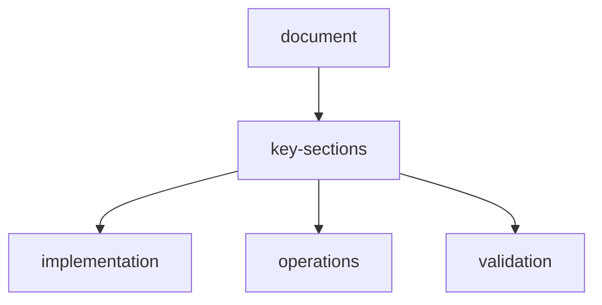

# system-architecture

## overview

WebScraper-OpenEnv is designed as a modular, dashboard-first RL environment with extensible APIs, MCP tools, and multi-model routing.

## high-level-topology

```text
Frontend Dashboard (React/Vite)
        |
        v
FastAPI Control Plane
  - episode lifecycle
  - action dispatch
  - reward engine
  - tool registry API
  - settings + policy
        |
        +--> Agent Runtime
        |      - planner/navigator/extractor/verifier
        |      - memory manager
        |      - model router
        |
        +--> MCP Gateway
        |      - tool discovery
        |      - lazy install/load
        |      - schema + timeout + retries
        |
        +--> Search Layer
        |      - provider routing
        |      - query optimization
        |      - credibility scoring
        |
        +--> Memory Layer
        |      - short/working/long/shared
        |      - vector index + persistent storage
        |
        +--> Observability
               - traces/logs/metrics/cost dashboard
```

## core-subsystems

### 1-control-plane

Responsibilities:

- reset/step/state APIs
- request validation
- action authorization and policy checks
- deterministic episode management

### 2-agent-runtime

Responsibilities:

- policy inference
- strategy execution
- fallback handling
- action explainability

### 3-tooling-plane-mcp

Responsibilities:

- dynamic tool registry
- server health checks
- lazy installation
- composition workflows

### 3-5-site-template-layer

Responsibilities:

- maintain inbuilt domain templates (`backend/app/sites/`)
- map instructions/assets to known site behavior
- provide reusable navigation goals/fields for planner and navigator agents
- expose template catalog through `/api/sites*` endpoints

### 4-data-plane

Responsibilities:

- HTML ingestion and chunking
- extraction and normalization
- verification and reconciliation
- output persistence

### 5-analytics-plane

Responsibilities:

- reward component logging
- model/token/cost accounting
- tool usage telemetry
- memory quality analytics

## processing-pipeline

1. `reset(task_id, seed)`
2. observation emitted
3. policy selects action
4. action executes (native/MCP/search/memory)
5. reward computed and logged
6. done check
7. repeat until terminal

## batch-and-parallel-design

### batch

- large HTML split into semantic chunks
- chunk extraction batched with bounded size
- merge + dedupe + confidence rank

### parallel

- independent chunk tasks run concurrently
- search and verification can run in parallel branches
- configurable worker limits and queue priorities

## queue-and-scheduler

Task queue supports:

- priority classes (`high`, `normal`, `low`)
- cancellation tokens
- retry policy with backoff
- dead-letter queue for repeated failures

## storage-architecture

- Episode state: in-memory + optional persistence
- Long-term memory: vector DB + metadata store
- Logs/metrics: append-only time-series-friendly sink
- Exports: JSON/CSV trace packs

## backend-folder-notes-template-system

```text
backend/app/sites/
  - models.py      # SiteTemplate dataclass
  - templates.py   # 50+ inbuilt site templates
  - registry.py    # list/get/match/serialize helpers
```

## reliability

- per-tool timeout and retry
- per-step safety budget
- circuit breaker for failing providers
- deterministic fallback chains

## security

- API key vaulting via env/config secrets
- MCP allowlist
- output sanitization
- redaction of sensitive tokens in logs

## deployment

Single-container baseline:

- frontend static build served by API backend
- optional sidecars for DB/vector/MCP infra

Scale-out profile:

- separate API and worker pools
- managed vector DB
- queue-backed distributed execution
- central observability backend

## compatibility-goals

- local dev mode with minimal dependencies
- cloud mode with managed infra
- optional self-hosted LLM endpoints

## future-architecture-extensions

- distributed multi-agent graph execution
- adaptive autoscaling by queue pressure
- global memory federation across projects

## api-reference-alignment

| architecture-plane | primary-endpoints |
| --- | --- |
| control-plane | `/api/health`, `/api/ready`, `/api/settings`, `/api/tasks` |
| episode-runtime | `/api/episode/reset`, `/api/episode/step`, `/api/episode/state/{episode_id}` |
| agent-runtime | `/api/agents/*`, `/api/providers/*` |
| tooling-memory | `/api/tools/*`, `/api/plugins/*`, `/api/memory/*` |
| scraping-runtime | `/api/scrape/stream`, `/api/scrape/{session_id}/result`, `/ws/episode/{episode_id}` |

Use `api-reference.md` as the authoritative endpoint inventory.

## document-metadata

| key | value |
| --- | --- |
| document | `architecture.md` |
| status | active |

## document-flow


