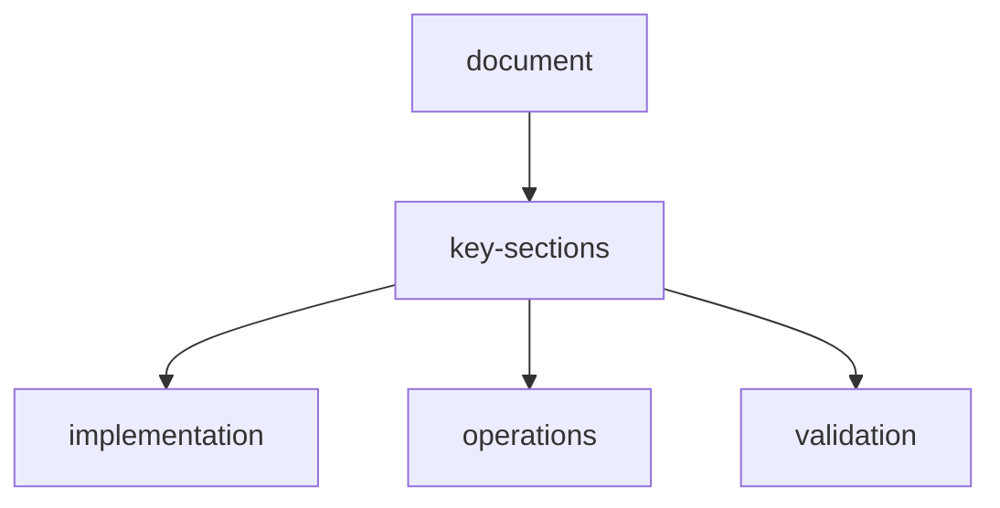

# advanced-features

## overview

This document captures high-end platform capabilities beyond baseline extraction.

## 1-self-improving-agent

Post-episode learning loop:

- classify failures by root cause
- update selector/tool strategy priors
- persist successful patterns with confidence
- penalize repeated failure paths

## 2-strategy-library

Built-in strategies:

- Search-first
- Direct extraction
- Multi-hop reasoning
- Verification-first
- Table-first

Each strategy tracks:

- win rate
- cost per success
- average latency
- domain affinity

## 3-explainable-ai-mode

For every decision, provide:

- selected action and confidence
- top alternatives considered
- evidence from memory/tools/search
- expected reward impact

## 4-human-in-the-loop

Intervention controls:

- approve/reject action
- force tool/model switch
- enforce verification before submit
- set hard constraints during runtime

## 5-scenario-simulator

Stress testing scenarios:

- noisy HTML
- broken DOM
- pagination traps
- conflicting facts
- anti-scraping patterns

Outputs:

- robustness score
- recovery score
- strategy suitability map

## 6-context-compression

- rolling summaries
- salience-based pruning
- token-aware context packing
- differential memory refresh

## 7-batch-parallel-runtime

- task queue with priorities
- parallel extraction workers
- bounded concurrency
- idempotent retry handling

## 8-prompt-versioning-and-evaluation

- versioned prompt templates
- A/B testing by task type
- reward/cost comparison dashboards
- rollout and rollback controls

## 9-mcp-toolchain-composition

Composable flow examples:

- Browser MCP -> Parser MCP -> Validator MCP -> DB MCP
- Search MCP -> Fetch MCP -> Extract MCP -> Verify MCP

## 10-governance-and-safety

- tool allowlist/denylist
- PII redaction in logs
- budget and rate guardrails
- provenance tracking for extracted facts

## feature-flags

All advanced features should be toggleable from Settings and safely disabled by default where cost/latency impact is high.

## api-driven-feature-map

| feature-domain | endpoint-surface |
| --- | --- |
| agent planning and execution | `/api/agents/run`, `/api/agents/plan`, `/api/agents/message` |
| dynamic scraping | `/api/scrape/stream`, `/api/scrape/`, `/api/scrape/sessions` |
| memory operations | `/api/memory/store`, `/api/memory/query`, `/api/memory/consolidate` |
| tool and plugin usage | `/api/tools/registry`, `/api/plugins/tools`, `/api/plugins/install` |
| model and provider controls | `/api/settings/model`, `/api/providers/models/all`, `/api/providers/costs/summary` |

See `api-reference.md` for full endpoint signatures.

## document-metadata

| key | value |
| --- | --- |
| document | `features.md` |
| status | active |

## document-flow

