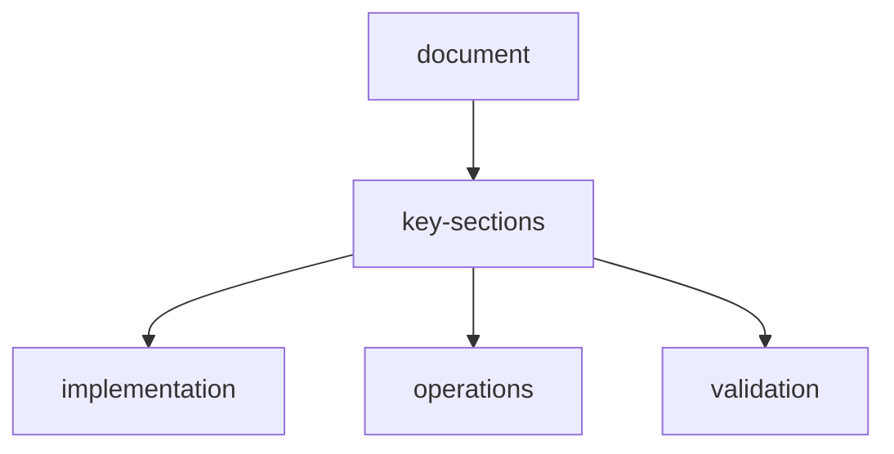

# observability-and-dashboard

## overview

Observability provides deep insight into runtime behavior, model usage, tool execution, memory quality, and rewards.

## dashboard-sections

### 1-live-thought-stream

- chronological reasoning notes
- model/router choice trace
- action confidence timeline
- override events

### 2-navigation-map

Graph of visited pages:

- nodes = URLs
- edges = transitions
- node color = relevance/confidence
- revisit highlighting

### 3-mcp-usage-panel

- tool call count by server
- avg latency by tool
- error rate and retries
- top successful tool chains

### 4-memory-viewer

- inspect short/working/long/shared memory
- filter by task/domain/confidence
- edit/delete entries
- prune previews

### 5-reward-analytics

- per-step reward breakdown
- component contribution trends
- penalty heatmap
- episode comparison

### 6-cost-and-token-monitor

- per-provider usage
- per-model token counts
- cumulative cost vs budget
- forecasted burn rate

## core-metrics

### agent-metrics

- task completion rate
- avg steps to completion
- recovery score
- generalization score
- exploration ratio

### tool-metrics

- tool success rate
- timeout ratio
- fallback frequency
- schema validation failures

### memory-metrics

- retrieval hit rate
- relevance score distribution
- prune rate
- memory-assisted success ratio

### search-metrics

- query success rate
- multi-hop depth distribution
- credibility score average
- duplicate result ratio

## logging-model

Structured logs (JSON):

```json
{
  "timestamp": "2026-03-27T00:00:00Z",
  "episode_id": "ep_123",
  "step": 7,
  "event": "tool_call",
  "tool": "beautifulsoup.find_all",
  "latency_ms": 54,
  "success": true,
  "reward_delta": 0.08
}
```

## tracing

Per-episode trace includes:

- observations
- actions
- rewards
- tool calls
- memory operations
- final submission and grader results

## alerts

Configurable alerts:

- budget threshold crossed
- error spike
- tool outage
- memory bloat
- anomalous low reward streak

## apis

- `GET /api/metrics/summary`
- `GET /api/metrics/timeseries`
- `GET /api/traces/{episode_id}`
- `GET /api/costs`
- `GET /api/memory/stats`
- `GET /api/tools/stats`

## recommended-dashboard-layout

1. Top row: completion, cost, latency, error rate
2. Mid row: thought stream + navigation graph
3. Lower row: reward breakdown + MCP usage + memory viewer
4. Bottom row: raw trace and export controls

## export-and-audit

Exports:

- JSON trace
- CSV metrics
- reward analysis report
- model usage report

All exports include episode and configuration fingerprints for reproducibility.


## related-api-reference

| item | value |
| --- | --- |
| api-reference | `api-reference.md` |

## document-metadata

| key | value |
| --- | --- |
| document | `observability.md` |
| status | active |

## document-flow


