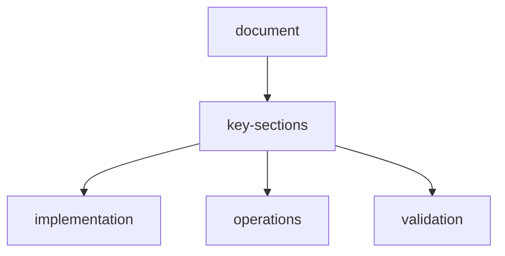

# openenv-specification-enhanced

## overview

This document defines the OpenEnv contract for WebScraper-OpenEnv with advanced memory, MCP tooling, multi-model routing, and long-page batch handling.

## core-interfaces

### observation

```python
class Observation(BaseModel):
    episode_id: str
    task_id: str
    step_number: int
    current_url: str
    page_html: str
    page_title: str
    available_actions: list[str]
    extracted_so_far: dict
    pages_visited: list[str]
    budget_remaining: int
    task_description: str
    target_fields: list[str]
    hints: list[str]

    # Enhanced
    memory_context: dict | None
    tool_registry_snapshot: list[dict] | None
    search_results: list[dict] | None
    page_chunks: list[dict] | None
```

### action

```python
class Action(BaseModel):
    action_type: str

    # Existing
    target_field: str | None = None
    selector: str | None = None
    navigate_to: str | None = None
    submit_extraction: dict | None = None
    notes: str | None = None

    # Search
    query: str | None = None
    search_engine: str | None = None
    result_limit: int = 5

    # Verification
    field_name: str | None = None
    claimed_value: str | None = None
    verification_source: str | None = None

    # Conflict resolution
    conflicting_sources: list[str] | None = None
    chosen_source: str | None = None
    rationale: str | None = None

    # MCP + Memory
    tool_name: str | None = None
    tool_params: dict | None = None
    memory_layer: str | None = None
    memory_key: str | None = None
    memory_query: str | None = None
```

### action-types

- `EXTRACT_FIELD`
- `NAVIGATE`
- `SEARCH_PAGE`
- `INSPECT_ELEMENT`
- `SUBMIT`
- `SKIP_PAGE`
- `SEARCH_ENGINE`
- `VERIFY_FACT`
- `RESOLVE_CONFLICT`
- `FETCH_URL`
- `MCP_TOOL_CALL`
- `WRITE_MEMORY`
- `READ_MEMORY`
- `SEARCH_MEMORY`
- `SUMMARIZE_MEMORY`
- `PRUNE_MEMORY`

### reward

```python
class Reward(BaseModel):
    value: float
    cumulative: float
    breakdown: dict
    message: str
```

## episode-lifecycle

```text
reset(task_id, seed?)
  -> observation(step=0)

step(action)
  -> observation, reward, done, info

state(episode_id)
  -> current snapshot
```

Terminal conditions:

- `SUBMIT` called
- budget exhausted
- max page limit reached
- fatal policy error

## state-machine

```text
RESET -> RUNNING -> TERMINAL
            |
            +-- NAVIGATE / EXTRACT / SEARCH / VERIFY / MCP / MEMORY
```

## task-profiles

### easy

- single-page extraction
- low noise
- hints enabled

### medium

- pagination
- moderate noise
- partial hints

### hard

- multi-hop search
- conflicting sources
- verification required
- no hints

## long-page-handling

When HTML exceeds token/size thresholds:

1. Semantic segmentation
2. Adaptive chunking
3. Batch extraction
4. Merge + dedupe + confidence rank
5. Optional diff-based incremental update

## mcp-integration-contract

On each step, environment may expose:

- tool registry snapshot
- per-tool input/output schema
- timeout and retry policy

Tool calls are evaluated for:

- correctness
- efficiency
- safety constraints

## search-engine-contract

Search action supports provider routing:

- Google
- Bing
- Brave
- DuckDuckGo
- Perplexity
- custom providers

Environment stores query + result metadata for observability.

## memory-contract

Layers:

- short-term (episode)
- working (reasoning)
- long-term (persistent)
- shared (multi-agent)

Mandatory metadata for write operations:

- `episode_id`
- `task_id`
- `confidence`
- `source`

## api-surface

| contract-area | endpoint |
| --- | --- |
| environment lifecycle | `/api/episode/reset`, `/api/episode/step`, `/api/episode/state/{episode_id}` |
| task catalog | `/api/tasks/`, `/api/tasks/{task_id}`, `/api/tasks/types/` |
| memory and tools | `/api/memory/*`, `/api/tools/registry`, `/api/plugins/tools` |
| scrape runtime | `/api/scrape/stream`, `/api/scrape/{session_id}/status`, `/api/scrape/{session_id}/result` |
| realtime updates | `/ws/episode/{episode_id}` |

For the complete endpoint inventory, use `api-reference.md`.

## determinism

Given `task_id + seed + config`, environment should be reproducible for grading and benchmarking.

## safety-and-guardrails

- enforce max steps and request budgets
- enforce MCP tool allowlist/denylist
- prevent secret leakage from tool outputs
- sanitize logs and traces

## document-metadata

| key | value |
| --- | --- |
| document | `openenv.md` |
| status | active |

## document-flow


