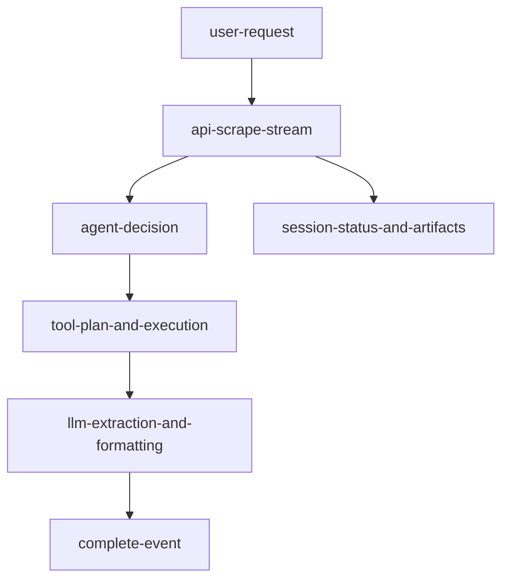

# overview

## purpose

This document is the top-level guide for the ScrapeRL documentation set. It explains what the platform does, how the main runtime surfaces connect, and where to find detailed references.

## platform-summary

| dimension | summary |
| --- | --- |
| core-goal | AI-first scraping workflows with RL-style episodes and dynamic agent planning |
| backend | FastAPI control plane with episode, scrape, agent, plugin, memory, and provider APIs |
| frontend | React dashboard for task submission, stream monitoring, and result inspection |
| runtime-pattern | session-based execution with real-time `step`/`tool_call` stream events |
| output-targets | `json`, `csv`, `markdown`, and `text` |
| integrations | OpenAI, Anthropic, Google, Groq, NVIDIA, plugin tools, memory layers |

## primary-runtime-flows

## documentation-navigation

| doc | focus-area |
| --- | --- |
| `readme.md` | documentation index |
| `api-reference.md` | complete endpoint catalog and stream/event contract |
| `architecture.md` | system topology, subsystem planes, reliability model |
| `openenv.md` | environment/action/observation/reward contract |
| `features.md` | advanced runtime features and toggles |
| `memory.md` | memory layers, storage, and operations |
| `plugins.md` | plugin registry and runtime tool-selection model |
| `tool-calls.md` | tool call payload schema and lifecycle |
| `api.md` | multi-model routing and provider behavior |
| `settings.md` | runtime setting controls and policy knobs |
| `observability.md` | telemetry/tracing/cost visibility |
| `rewards.md` | reward design and scoring structure |
| `search-engine.md` | search provider and retrieval routing details |
| `mcp.md` | mcp integration architecture |
| `agents.md` | agent roles and coordination model |

## key-api-surfaces

| surface | endpoints |
| --- | --- |
| system-health | `/api/health`, `/api/ready`, `/api/ping` |
| episode-runtime | `/api/episode/reset`, `/api/episode/step`, `/api/episode/state/{episode_id}` |
| scrape-runtime | `/api/scrape/stream`, `/api/scrape/{session_id}/status`, `/api/scrape/{session_id}/result` |
| agent-tool-memory | `/api/agents/*`, `/api/tools/*`, `/api/plugins/*`, `/api/memory/*` |
| realtime-channel | `/ws/episode/{episode_id}` |

Use `api-reference.md` for full method/path listings.

## configuration-surfaces

| file | intent |
| --- | --- |
| `.env.example` | complete variable template for app + inference runtime |
| `.env` | local runtime values |
| `docker-compose.yml` | backend/frontend orchestration and env wiring |
| `inference.py` | OpenEnv-compliant inference entrypoint and stdout contract |

## recommended-reading-order

1. `overview.md`
2. `api-reference.md`
3. `architecture.md`
4. `openenv.md`
5. `tool-calls.md`
6. `plugins.md`
7. domain docs (`memory.md`, `api.md`, `features.md`, `settings.md`)

## document-metadata

| key | value |
| --- | --- |
| document | `overview.md` |
| status | active |
| owner | platform-docs |

