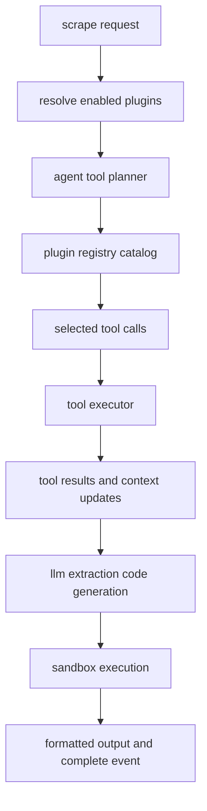
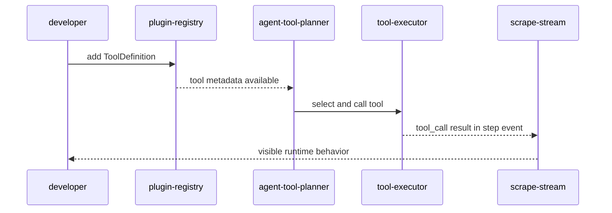

# plugins

## plugin-registry-overview

The plugin registry is the canonical catalog of callable capabilities used by the scraper runtime and agent tool planner.

Current registry snapshot:

| metric | value |
| --- | ---: |
| plugin-groups | 12 |
| total-tools | 82 |
| source-file | `backend/app/plugins/registry.py` |

## plugin-group-matrix

| plugin-id | category | tool-count | primary-purpose |
| --- | --- | ---: | --- |
| `browser` | `browser` | 8 | navigation and interaction actions |
| `html-parser` | `parser` | 13 | html and dom parsing/extraction |
| `data-processing` | `data` | 13 | json/csv/dataframe style transforms |
| `regex` | `extraction` | 5 | pattern matching and text extraction |
| `network` | `network` | 5 | http/url operations |
| `media` | `media` | 4 | media and document extraction |
| `analysis` | `analysis` | 7 | schema/relevance/stats/text analysis |
| `extraction` | `extraction` | 8 | contact/date/price/entity extraction |
| `validation` | `validation` | 7 | url/json/schema/signal validation |
| `storage` | `storage` | 5 | memory and cache operations |
| `sandbox` | `ai` | 3 | sandboxed code execution |
| `ai` | `ai` | 4 | ai completion/embedding/classification |

## runtime-usage-model

## request-and-selection-rules

| input-surface | behavior |
| --- | --- |
| `enable_plugins` | requested plugin ids from the request payload |
| plugin-resolver | filters to installed plugin ids and returns enabled + missing lists |
| `selected_agents` | controls agent roles/modules, independent from plugin install state |
| runtime planner | chooses tools dynamically from registry metadata, not fixed site templates |

## plugin-extension-checklist

1. add new `ToolDefinition` entries in `backend/app/plugins/registry.py`
2. ensure tool names use namespace format (`namespace.action`)
3. provide parameter and return schemas in the registry entry
4. implement runtime behavior in agent executor if the namespace is executable in-agent
5. expose and verify behavior via scrape stream step events

## plugin-extension-flow

## recently-added-tools

| namespace | tool-name | intent |
| --- | --- | --- |
| `html` | `html.extract_meta` | capture title and meta tags |
| `html` | `html.extract_jsonld` | parse structured json-ld blocks |
| `html` | `html.detect_repeating_blocks` | identify repeated dom structures |
| `data` | `data.dedupe_rows` | remove duplicate records |
| `data` | `data.rank_rows` | rank rows by selected score field |
| `data` | `data.select_columns` | project rows to requested columns |
| `analysis` | `analysis.infer_schema` | infer field types/nullability |
| `analysis` | `analysis.score_relevance` | score rows against instructions |
| `extract` | `extract.top_n` | keep top-n records |
| `validate` | `validate.data_completeness` | completeness score by field |
| `validate` | `validate.row_signal` | estimate row quality signal |
## related-api-reference

| item | value |
| --- | --- |
| api-reference | `api-reference.md` |
