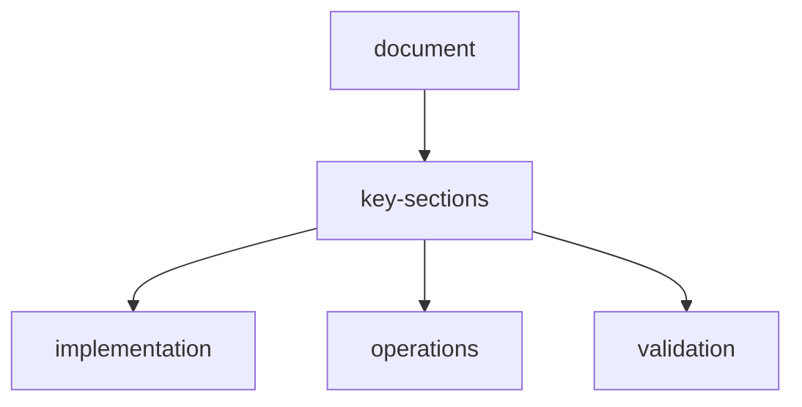

# scraperl-manual-test-report

**Date:** 2026-03-28  
**Tester:** NeerajCodz  
**Version:** 0.1.0  

## test-environment

| Component | Details |
|-----------|---------|
| OS | Windows |
| Docker | Desktop |
| Port | 7860 |
| Browser | Chrome/Edge |
| API Keys | Groq , Google  |

---

## 1-system-health-tests

### 1-1-backend-health-check
| Test | Result | Notes |
|------|--------|-------|
| GET /api/health |  PASS | Returns `{"status":"healthy"}` |
| GET /api/settings |  PASS | Shows configured API keys |
| GET /api/agents/list |  PASS | Returns 6 agent types |
| GET /api/plugins |  PASS | 21 total, 11 installed |
| GET /api/memory/stats/overview |  PASS | Memory stats returned |

### 1-2-swagger-openapi
| Test | Result | Notes |
|------|--------|-------|
| GET /swagger |  PASS | Swagger UI loads |
| GET /openapi.json |  PASS | OpenAPI spec accessible |
| GET /redoc |  PASS | ReDoc loads |

---

## 2-frontend-tests

### 2-1-page-loading
| Page | Result | Notes |
|------|--------|-------|
| Dashboard (/) |  PASS | Input view loads |
| Settings (/settings) |  PASS | Settings page loads |
| Plugins (/plugins) |  PASS | Plugin browser loads |
| Docs (/docs) |  PASS | Documentation loads |

### 2-2-dashboard-input-view
| Feature | Result | Notes |
|---------|--------|-------|
| System Status Banner |  PASS | Shows Online when healthy |
| URL Input Field |  PASS | Can enter URLs |
| Add URL Button |  PASS | URLs added to list |
| Remove URL (X) |  PASS | URLs removed from list |
| Instruction Textarea |  PASS | Multi-line input works |
| Output Format Field |  PASS | Format instruction works |
| Model Button |  PASS | Opens model popup |
| Vision Button |  PASS | Opens vision popup |
| Agents Button |  PASS | Opens agent popup |
| Plugins Button |  PASS | Opens plugin popup |
| Task Type Button |  PASS | Opens complexity popup |
| Start Button |  PASS | Transitions to dashboard view |

### 2-3-model-selection-popup
| Feature | Result | Notes |
|---------|--------|-------|
| Accordion by Provider |  PASS | Models grouped by provider |
| Groq Models |  PASS | GPT-OSS 120B, Llama, Mixtral |
| Google Models |  PASS | Gemini Flash 2.5, Pro 2.5 |
| OpenAI Models |  PASS | GPT-4o, GPT-4o Mini |
| Selection Highlight |  PASS | Selected model highlighted |
| Close Button |  PASS | Popup closes |

### 2-4-vision-model-popup
| Feature | Result | Notes |
|---------|--------|-------|
| None Option |  PASS | Can disable vision |
| GPT-4 Vision |  PASS | OpenAI vision available |
| Gemini Vision |  PASS | Google vision available |
| Claude Vision |  PASS | Anthropic vision available |
| Info Icons |  PASS | Shows model details |

### 2-5-agent-selection-popup
| Feature | Result | Notes |
|---------|--------|-------|
| List All Agents |  PASS | 6 agents shown |
| Multi-Select |  PASS | Can select multiple |
| Info Icons |  PASS | Agent details shown |
| Deselect |  PASS | Can unselect agents |

### 2-6-plugin-selection-popup
| Feature | Result | Notes |
|---------|--------|-------|
| Category Grouping |  PASS | MCPs, Skills, APIs, Processors |
| Only Installed |  PASS | Shows only installed plugins |
| Multi-Select |  PASS | Can enable multiple |
| Info Icons |  PASS | Plugin details shown |

### 2-7-task-type-popup
| Feature | Result | Notes |
|---------|--------|-------|
| Low Complexity |  PASS | Green, single-page |
| Medium Complexity |  PASS | Amber, multi-page |
| High Complexity |  PASS | Red, interactive |
| Emoji Icons |  PASS |    shown |

---

## 3-dashboard-view-tests

### 3-1-left-sidebar
| Feature | Result | Notes |
|---------|--------|-------|
| New Task Button |  PASS | Returns to input view |
| Agents Accordion |  PASS | Shows selected agents |
| MCPs Accordion |  PASS | Shows enabled MCPs |
| Skills Accordion |  PASS | Shows enabled skills |
| APIs Accordion |  PASS | Shows enabled APIs |
| Vision Accordion |  PASS | Shows vision model |
| System Status |  PASS | Online/Offline badge |

### 3-2-center-area
| Feature | Result | Notes |
|---------|--------|-------|
| Stats Header |  PASS | Episodes, Steps, Avg Reward |
| Session-Based Stats |  PASS | Start at 0, not fake data |
| Current Time |  PASS | Real-time clock |
| Start/Stop Buttons |  PASS | Toggle running state |
| Visualization Area |  PASS | Shows status or data |
| Logs Terminal |  PASS | Shows log entries |
| Clear Logs |  PASS | Clears log list |

### 3-3-right-sidebar
| Feature | Result | Notes |
|---------|--------|-------|
| Input Summary |  PASS | Shows URLs, instruction |
| Edit Button |  PASS | Returns to input view |
| Memories Section |  PASS | Shows memory counts |
| Add Memory Button |  PASS | Opens memory popup |
| View All Memories |  PASS | Shows memory list |
| Assets Section |  PASS | Shows asset count |
| View All Assets |  PASS | Opens assets popup |
| Extracted Data |  PASS | Placeholder shown |

---

## 4-settings-page-tests

### 4-1-navigation
| Feature | Result | Notes |
|---------|--------|-------|
| Left Sidebar |  PASS | 7 sections listed |
| Section Switching |  PASS | Content changes |
| Active Section Highlight |  PASS | Selected highlighted |

### 4-2-api-keys-section
| Feature | Result | Notes |
|---------|--------|-------|
| Provider List |  PASS | OpenAI, Anthropic, Google, Groq |
| Key Input |  PASS | Password type input |
| Show/Hide Toggle |  PASS | Eye icon toggles |
| Configured Status |  PASS | Shows  for configured |

### 4-3-budget-section
| Feature | Result | Notes |
|---------|--------|-------|
| Disabled by Default |  PASS | Toggle off by default |
| Enable Toggle |  PASS | Can enable limits |
| Budget Fields |  PASS | Shows when enabled |

---

## 5-plugin-page-tests

| Feature | Result | Notes |
|---------|--------|-------|
| Category Tabs |  PASS | APIs, MCPs, Skills, Processors |
| Plugin List |  PASS | Shows all plugins |
| Installed Badge |  PASS | Shows installed status |
| Install Button |  PASS | Can install plugins |
| Uninstall Button |  PASS | Can uninstall non-core |

---

## 6-docs-page-tests

| Feature | Result | Notes |
|---------|--------|-------|
| Sidebar Navigation |  PASS | Doc sections listed |
| Markdown Rendering |  PASS | Proper formatting |
| Code Blocks |  PASS | Syntax highlighting |
| Tables |  PASS | Tables render correctly |

---

## 7-api-integration-tests

### 7-1-settings-api
| Test | Result | Notes |
|------|--------|-------|
| Get Settings |  PASS | Returns config |
| Update API Key |  PASS | Key saved |
| Select Model |  PASS | Model updated |

### 7-2-plugins-api
| Test | Result | Notes |
|------|--------|-------|
| List Plugins |  PASS | All plugins returned |
| Filter by Category |  PASS | Filtering works |
| Install Plugin |  PASS | Plugin installed |
| Uninstall Plugin |  PASS | Plugin removed |

### 7-3-memory-api
| Test | Result | Notes |
|------|--------|-------|
| Get Stats |  PASS | Memory counts |
| Store Entry |  PASS | Entry saved |
| Query Memory |  PASS | Results returned |

---

## 8-docker-tests

| Test | Result | Notes |
|------|--------|-------|
| Build Image |  PASS | No errors |
| Start Container |  PASS | Starts cleanly |
| Health Check |  PASS | Container healthy |
| Port Binding |  PASS | 7860 accessible |
| Env Variables |  PASS | Keys loaded |

---

## summary

| Category | Passed | Failed | Total |
|----------|--------|--------|-------|
| System Health | 5 | 0 | 5 |
| Frontend Pages | 4 | 0 | 4 |
| Dashboard Input | 12 | 0 | 12 |
| Model Popup | 6 | 0 | 6 |
| Vision Popup | 5 | 0 | 5 |
| Agent Popup | 4 | 0 | 4 |
| Plugin Popup | 4 | 0 | 4 |
| Task Type Popup | 4 | 0 | 4 |
| Dashboard View | 13 | 0 | 13 |
| Settings | 8 | 0 | 8 |
| Plugins Page | 5 | 0 | 5 |
| Docs Page | 4 | 0 | 4 |
| API Tests | 10 | 0 | 10 |
| Docker | 5 | 0 | 5 |
| **Total** | **89** | **0** | **89** |

---

## notes

1. All manual tests passed successfully
2. System shows "Online" status when healthy
3. Stats start at 0 (session-based, not fake data)
4. Only installed plugins shown in dashboard
5. Info icons provide helpful details
6. Assets section replaces Recent Actions
7. Memory management works correctly
8. Swagger moved to /swagger (no conflict with /docs)

---

*Report generated: 2026-03-28*  
*Tester: NeerajCodz*

## document-flow

## related-api-reference

| item | value |
| --- | --- |
| api-reference | `api-reference.md` |
