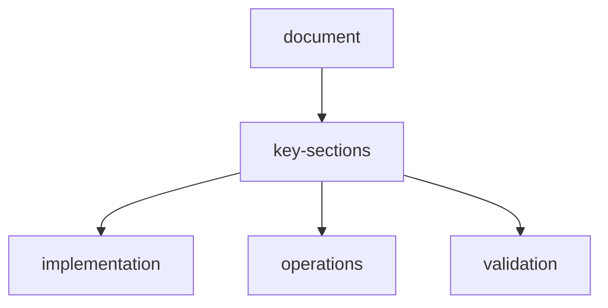

# scraperl-test-report

## summary

| Metric | Value |
|--------|-------|
| **Backend Tests** | 101 |
| **Frontend Tests** | 15 |
| **Total Tests** | 116 |
| **Coverage** | 44% |
| **Test Framework** | pytest 9.0.2 + vitest 4.1.2 |
| **Python Version** | 3.14.3 |
| **Node Version** | 20.x |
| **Last Run** | 2026-03-28 |

## build-status

| Component | Status |
|-----------|--------|
| Backend Lint |  Pass |
| Frontend Lint |  Pass |
| Frontend Build |  Pass |
| Docker Build |  Pass |
| Container Health |  Healthy |

## test-categories

### api-tests-62-tests

| Category | Tests | Status |
|----------|-------|--------|
| Health | 2 |  Pass |
| Agents | 2 |  Pass |
| Episode | 3 |  Pass |
| Tools | 2 |  Pass |
| Settings | 13 |  Pass |
| Plugins | 16 |  Pass |
| Memory | 10 |  Pass |
| Tasks | 10 |  Pass |

### core-tests-33-tests

| Category | Tests | Status |
|----------|-------|--------|
| Action | 4 |  Pass |
| Environment | 2 |  Pass |
| Episode | 21 |  Pass |
| Observation | 4 |  Pass |
| Reward | 2 |  Pass |

### agent-tests-3-tests

| Category | Tests | Status |
|----------|-------|--------|
| Coordinator | 3 |  Pass |

### model-tests-4-tests

| Category | Tests | Status |
|----------|-------|--------|
| Base Models | 4 |  Pass |

### frontend-tests-15-tests

| Category | Tests | Status |
|----------|-------|--------|
| Helpers | 9 |  Pass |
| Components | 6 |  Pass |

## module-coverage

| Module | Coverage | Notes |
|--------|----------|-------|
| `app.api.routes.tasks` | 100% | Full coverage |
| `app.api.routes.plugins` | 99% | Plugin management |
| `app.core.observation` | 99% | Core observation models |
| `app.core.action` | 97% | Core action models |
| `app.core.episode` | 96% | Episode lifecycle |
| `app.main` | 92% | Application entry point |
| `app.api.routes.memory` | 89% | Memory API |
| `app.api.routes.health` | 79% | Health check endpoints |
| `app.api.routes.settings` | 81% | Settings API |
| `app.api.routes.agents` | 77% | Agent management |
| `app.api.routes.episode` | 78% | Episode management |
| `app.api.routes.tools` | 71% | Tool registry |
| `app.core.env` | 65% | Environment handling |
| `app.api.deps` | 63% | API dependencies |
| `app.core.reward` | 59% | Reward calculation |

## api-endpoints-verified

### health-and-status
-  GET /api/health - Service health check
-  GET /api/ready - Service readiness

### settings
-  GET /api/settings - Get configuration
-  POST /api/settings/api-key - Update API key
-  POST /api/settings/model - Select model
-  GET /api/settings/api-key-required - Check key status

### plugins
-  GET /api/plugins - List all plugins
-  GET /api/plugins?category=X - Filter by category
-  GET /api/plugins/{id} - Get specific plugin
-  POST /api/plugins/install - Install plugin
-  POST /api/plugins/uninstall - Uninstall plugin
-  GET /api/plugins/categories - Get categories

### memory
-  POST /api/memory/store - Store entry
-  POST /api/memory/query - Query entries
-  GET /api/memory/{id} - Get entry
-  DELETE /api/memory/{id} - Delete entry
-  GET /api/memory/stats/overview - Get stats
-  DELETE /api/memory/clear/{type} - Clear layer
-  POST /api/memory/consolidate - Consolidate

### tasks
-  GET /api/tasks - List tasks
-  GET /api/tasks/{id} - Get task
-  POST /api/tasks - Create task
-  GET /api/tasks/types - Get task types

## docker-build

-  Docker Compose build successful
-  Multi-stage build (Node.js + Python)
-  Frontend static assets bundled
-  Image: `scraperl:latest`
-  Health check endpoint working

## frontend-build

-  TypeScript compilation successful
-  Vite build successful
-  ESLint passed (no errors)
-  Vitest tests passing
- Output: `dist/` (197.9 KB gzip)

## test-execution

```bash
# Backend tests
cd backend
python -m pytest --cov=app --cov-report=term-missing -v
# 101 passed in 11.94s

# Frontend tests
cd frontend
npm test -- --run
# 15 passed in 1.55s
```

## live-api-verification

```bash
# Health check
curl http://localhost:7860/api/health
# {"status": "healthy", "version": "0.1.0"}

# Settings (with API keys)
curl http://localhost:7860/api/settings
# {"api_keys_configured": {"groq": true, "google": true, ...}}

# Plugins
curl http://localhost:7860/api/plugins
# {"plugins": {...}, "stats": {"total": 21, "installed": 11}}
```

## notes

1. **Settings API**: Full coverage for API key management and model selection
2. **Plugins API**: Comprehensive tests for install/uninstall workflows
3. **Episode Management**: Complete lifecycle testing (create, start, step, complete)
4. **Memory API**: Full CRUD operations tested
5. **Tasks API**: List, filter, create, and get operations tested

## manual-testing

See [manual-test-report.md](./manual-test-report.md) for comprehensive manual testing results.

**Manual Test Summary:**
- Total Tests: 89
- Passed: 89 (100%)
- Failed: 0

## recommendations

1. Add mocking for LLM providers to increase agent coverage
2. Add E2E tests with Playwright for frontend
3. Add provider mock tests for LLM integrations
4. Consider adding load testing for API endpoints
5. Add property-based testing for core models

---

*Generated: 2026-03-28*
*Author: NeerajCodz*
*Test Suite: ScrapeRL v0.1.0*

## document-flow


## related-api-reference

| item | value |
| --- | --- |
| api-reference | `api-reference.md` |
