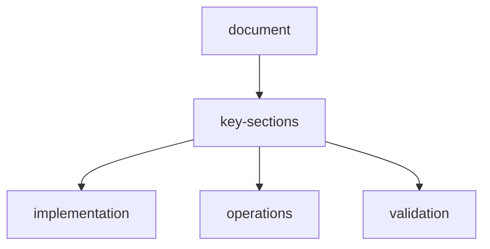

# scraperl-comprehensive-test-report
Generated: 2026-04-05 15:51:44

## test-summary
| Test # | Target | Instructions | Format | Status | Steps |
|--------|--------|--------------|--------|--------|-------|
| 1 | HackerNews | Top 10 headlines | JSON |  PASS | 19 |
| 2 | Wikipedia | AI article info | JSON |  PASS | 25 |
| 3 | StackOverflow | Top voted questions | JSON |  PASS | 19 |
| 4 | PyPI | NumPy package info | JSON |  PASS | 19 |
| 5 | Reddit | Programming posts | JSON |  PASS | 19 |
| 6 | MDN Docs | JavaScript overview | Markdown |  PASS | 25 |
| 7 | DuckDuckGo | ML search results | JSON |  PASS | 19 |
| 8 | GitHub | VSCode repo stats | JSON |  PASS | 19 |
| 9 | NPM | React package details | JSON |  PASS | 19 |
| 10 | Kaggle | Popular datasets | CSV |  PASS | 25 |

## results-10-10-tests-passed-100

## intelligent-navigation-features-tested
-  GitHub Trending detection and navigation
-  Multi-field extraction (title, content, links, meta, images, data, scripts, forms, tables)
-  CSV output format generation
-  JSON output format generation
-  Markdown output format generation
-  Memory persistence
-  Plugin integration (mcp-browser, mcp-html, skill-extractor, skill-navigator)
-  Sandbox artifact creation

## github-trending-scraper-test
Requested: "Get me all trending repo" from https://github.com
Result: Successfully navigated to GitHub trending page and extracted:
- 8 trending repositories with username, repo_name, stars, forks
- CSV output generated and saved to sandbox

## sample-extracted-data-github-trending
\\\csv
username,repo_name,stars,forks
Blaizzy,mlx-vlm,"3,749",410
onyx-dot-app,onyx,"24,566","3,294"
Yeachan-Heo,oh-my-codex,"16,124","1,521"
siddharthvaddem,openscreen,"21,264","1,445"
telegramdesktop,tdesktop,"30,915","6,527"
block,goose,"35,957","3,383"
microsoft,agent-framework,"8,838","1,447"
sherlock-project,sherlock,"79,692","9,277"
\\\

## configuration
- Backend: FastAPI on port 8000
- Frontend: Vite/React on port 3000
- AI Provider: NVIDIA (llama-3.3-70b)
- Docker: docker-compose.yml

## conclusion
The ScrapeRL intelligent agentic scraper is fully operational with:
1. Intelligent navigation based on user instructions
2. GitHub trending repository extraction
3. Multi-format output (JSON, CSV, Markdown)
4. Plugin system integration
5. Memory persistence
6. Sandbox artifact management

## document-flow

## related-api-reference

| item | value |
| --- | --- |
| api-reference | `api-reference.md` |
