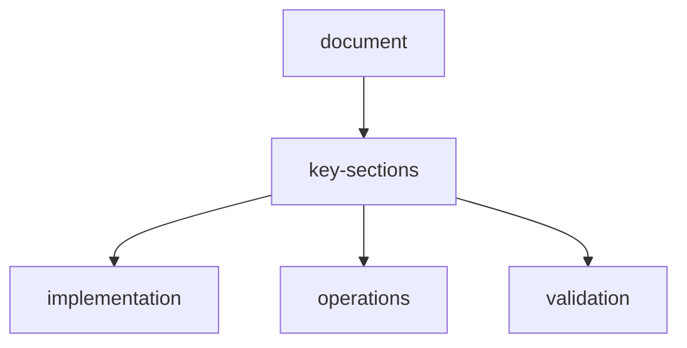

# scraperl-full-agentic-sandbox-validation-report

## scope

Validated the end-to-end Docker flow (`docker compose up`) with backend/frontend integration, real scrape execution, agent/plugin orchestration, sandboxed Python execution, session artifacts, memory stats, and realtime stream events.

## environment

- Stack: `docker compose` (frontend `:3000`, backend `:8000`)
- Build path validated after backend changes (TLS fallback, CSV detection fix, memory stats integration).
- Providers exercised: **NVIDIA** and **Groq**.
- Plugins exercised: search/browser/html/json + python sandbox (`proc-python`, `proc-pandas`, `proc-numpy`, `proc-bs4`).

## critical-endpoint-smoke-checks-via-http-localhost-3000

| Endpoint | Status |
| --- | --- |
| `/api/health` | 200 |
| `/api/agents/list` | 200 |
| `/api/plugins` | 200 |
| `/api/memory/stats/overview` | 200 |
| `/api/settings` | 200 |
| `/api/agents/catalog` | 200 |
| `/api/agents/installed` | 200 |
| `/api/scrape/sessions` | 200 |

## 10-real-scenario-results

All scenarios completed successfully in the final run (**10/10 completed, 0 partial, 0 failed**).

| ID | Provider | Complexity | Output | Status | Steps | Reward | URLs | Sandbox Artifacts |
| --- | --- | --- | --- | --- | ---: | ---: | ---: | ---: |
| T1-low-nvidia-json | nvidia | low | json | completed | 13 | 4.8777 | 1 | 6 |
| T2-medium-nvidia-markdown | nvidia | medium | markdown | completed | 19 | 7.3560 | 1 | 6 |
| T3-high-nvidia-gold-csv | nvidia | high | csv | completed | 50 | 19.3423 | 2 | 8 |
| T4-high-nvidia-python-analysis | nvidia | high | json | completed | 30 | 9.5663 | 1 | 6 |
| T5-medium-nvidia-multiasset-csv | nvidia | medium | csv | completed | 36 | 14.5493 | 2 | 8 |
| T6-low-groq-json | groq | low | json | completed | 13 | 4.8773 | 1 | 6 |
| T7-high-groq-python | groq | high | markdown | completed | 30 | 9.5663 | 1 | 6 |
| T8-medium-nvidia-memory-artifacts | nvidia | medium | json | completed | 23 | 7.3560 | 1 | 6 |
| T9-high-nvidia-selected-agents | nvidia | high | json | completed | 26 | 9.6002 | 1 | 6 |
| T10-stream-realtime | nvidia | medium | json | completed | 19 | 0.0000 | 1 | 0 |

## realtime-stream-validation

- Stream test emitted: `init`, `step`, `url_start`, `url_complete`, `complete`.
- Final stream status: `completed`.

## memory-session-validation

- Memory stats now reflect scrape writes (integrated with runtime memory manager).
- Matrix run totals moved from **48** to **92** entries (short-term + long-term growth observed).
- Isolated sanity check: memory totals changed from **0** to **4** after one memory-enabled scrape session.
- Session sandbox artifacts are listable/readable through:
  - `GET /api/scrape/{session_id}/sandbox/files`
  - `GET /api/scrape/{session_id}/sandbox/files/{file_name}`

## fixes-validated-during-this-cycle

1. TLS/certificate fallback for web fetch in Dockerized runtime (with explicit warning and controlled retry).
2. Correct navigation failure handling in scrape pipeline (no false-success navigation state).
3. CSV detection corrected to avoid misclassifying HTML as CSV.
4. Memory stats endpoint integrated with runtime memory manager counts.
5. Agent catalog/install/uninstall API flow and frontend **Agents** tab routing integration.
6. Backend and frontend test suites continue to pass after changes.

## document-flow

## related-api-reference

| item | value |
| --- | --- |
| api-reference | `api-reference.md` |
