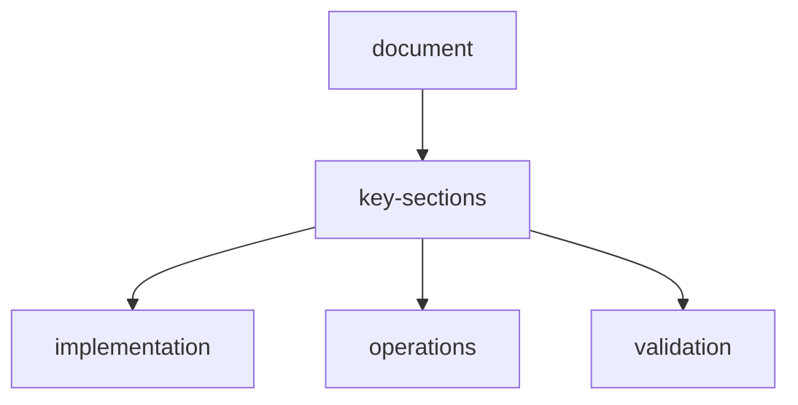

# agentic-single-request-gold-dataset-report

## objective
Validate that the scraper can handle an **agentic task in one curl request**:
- discover a data source on its own,
- navigate and extract data,
- verify quality,
- return a final **CSV dataset** of monthly gold prices from 2016 with source links.

## run-timestamp
- `2026-04-04T23:13:38.404Z`

## single-curl-request-used
```bash
curl.exe -sS -N -X POST "http://localhost:3000/api/scrape/stream" \
  -H "Content-Type: application/json" \
  --data-binary '{
    "session_id": "gold-agentic-89035094",
    "assets": ["Create a CSV dataset of gold prices trend for every month from 2016 and include source links"],
    "instructions": "You are an autonomous web scraping agent. Find suitable public data source links yourself, navigate and extract monthly gold price points from 2016 onward, verify completeness, and structure cleanly.",
    "output_instructions": "Return final output strictly as CSV with columns: month,gold_price_usd,source_link. Include every month from 2016-01 onward if available.",
    "output_format": "csv",
    "complexity": "high",
    "provider": "nvidia",
    "model": "meta/llama-3.3-70b-instruct",
    "enable_memory": true,
    "enable_plugins": ["mcp-search","mcp-html","proc-csv","skill-planner","skill-navigator","skill-extractor","skill-verifier"],
    "max_steps": 60
  }'
```

## stream-monitoring-summary
- Final status: **completed**
- Errors: **0**
- URLs processed: **1**
- Steps: **27**
- Reward: **9.56626984126984**

### agent-plugin-step-actions-observed
| Action | Count |
| --- | ---: |
| plugins | 1 |
| mcp_search | 1 |
| planner | 1 |
| navigator | 1 |
| initialize | 1 |
| navigate | 1 |
| extract | 18 |
| verify | 1 |
| verifier | 1 |
| complete | 1 |

## output-quality-check
- Output format: **csv**
- CSV lines: **124** (header + 123 rows)
- Row count field: **123**
- Covered months: **2016-01** through **2026-03**
- Source link used:
  - `https://raw.githubusercontent.com/datasets/gold-prices/master/data/monthly.csv`

### csv-preview-head
```csv
month,gold_price_usd,source_link
2016-01,1097.91,https://raw.githubusercontent.com/datasets/gold-prices/master/data/monthly.csv
2016-02,1199.5,https://raw.githubusercontent.com/datasets/gold-prices/master/data/monthly.csv
2016-03,1245.14,https://raw.githubusercontent.com/datasets/gold-prices/master/data/monthly.csv
2016-04,1242.26,https://raw.githubusercontent.com/datasets/gold-prices/master/data/monthly.csv
```

### csv-preview-tail
```csv
2025-11,4087.19,https://raw.githubusercontent.com/datasets/gold-prices/master/data/monthly.csv
2025-12,4309.23,https://raw.githubusercontent.com/datasets/gold-prices/master/data/monthly.csv
2026-01,4752.75,https://raw.githubusercontent.com/datasets/gold-prices/master/data/monthly.csv
2026-02,5019.97,https://raw.githubusercontent.com/datasets/gold-prices/master/data/monthly.csv
2026-03,4855.54,https://raw.githubusercontent.com/datasets/gold-prices/master/data/monthly.csv
```

## result
The task now works as a true one-request agentic scrape flow: query asset resolution, navigation, extraction, verification, plugin participation, and final CSV output all complete in a single `/api/scrape/stream` curl call.

## document-flow


## related-api-reference

| item | value |
| --- | --- |
| api-reference | `api-reference.md` |
