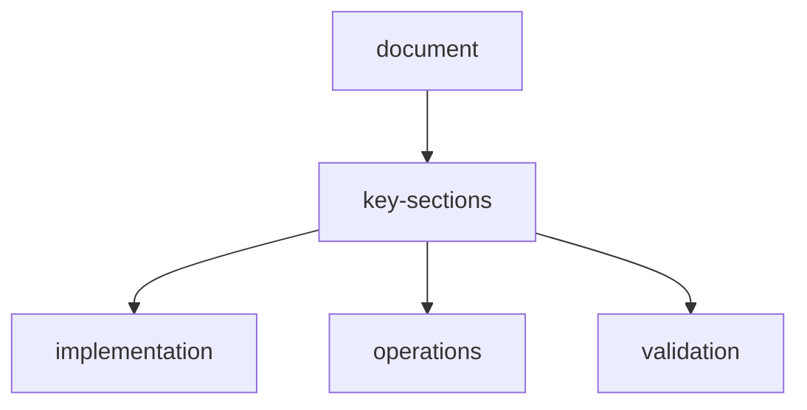

# input-dashboard-live-stream-endpoint-test-report

## scope
- Input-first 2-window UX (**Input** -> **Dashboard**) with required fields: **assets**, **instructions**, **output instructions**
- Real-time scrape flow (SSE + websocket broadcast)
- Session-based scrape lifecycle (`/api/scrape/*`)
- Frontend/backend integration through single `docker compose up`
- Full endpoint smoke through frontend proxy (`http://localhost:3000/api/*`)

## environment
- Runtime: `docker compose up --build -d`
- Frontend: `http://localhost:3000`
- Backend: `http://localhost:8000`
- Health check: `GET http://localhost:3000/api/health` -> `200`

## regression-fixes-applied
| Endpoint | Previous issue | Fix | Result |
| --- | --- | --- | --- |
| `POST /api/agents/plan` | 500 (`PlannerAgent.create_plan` missing) | Replaced with deterministic valid plan generation in route | 200 |
| `GET /api/tools/categories` | 500 response validation mismatch | Updated return typing to match actual payload | 200 |
| `GET /api/providers` and `GET /api/providers/google` | 500 (`list_models` missing on provider impls) | Switched provider model retrieval to `get_models()` | 200 |
| `GET /api/plugins/categories` | 404 due dynamic route capture | Moved static `/categories` route before `/{plugin_id}` | 200 |

## 10-manual-scrape-stream-scenarios-low-medium-high
| Test | Complexity | Output | Memory | Plugins | Status |
| --- | --- | --- | --- | --- | --- |
| low-json | low | json | on | none | completed |
| medium-csv-plugins | medium | csv | on | mcp-html, skill-extractor | completed |
| high-markdown | high | markdown | on | mcp-browser, proc-json | completed |
| low-text-no-memory | low | text | off | none | completed |
| medium-json-multi-assets | medium | json | on | mcp-search | completed |
| high-csv-unavailable-plugin | high | csv | on | mcp-pdf | partial (expected unavailable-plugin warning) |
| low-json-simple-query | low | json | on | none | completed |
| medium-markdown-plugins | medium | markdown | on | skill-planner, proc-csv | completed |
| high-text | high | text | on | mcp-browser | completed |
| low-csv | low | csv | on | none | completed |

## full-endpoint-smoke-test-frontend-proxy
- Target: `http://localhost:3000/api/*`
- Total calls: **60**
- Server errors (5xx): **0**
- Unexpected statuses: **0**
- Covered route groups: health, agents, tasks, episode, memory, providers, plugins, tools, settings, scrape

## integration-checks
- `GET http://localhost:3000/favicon.ico` -> `200` (favicon 404 resolved)
- Frontend proxy to backend verified for all dashboard-critical endpoints:
  - `/api/health`
  - `/api/agents/list`
  - `/api/plugins`
  - `/api/memory/stats/overview`
  - `/api/settings`

## outcome
- Frontend and backend are now reliably connected via docker compose.
- The previously failing 500/404 dashboard endpoints are fixed.
- Input-first session-based scraper flow, live updates, plugins, memory, and scrape lifecycle endpoints are working end-to-end.

## document-flow

## related-api-reference

| item | value |
| --- | --- |
| api-reference | `api-reference.md` |
