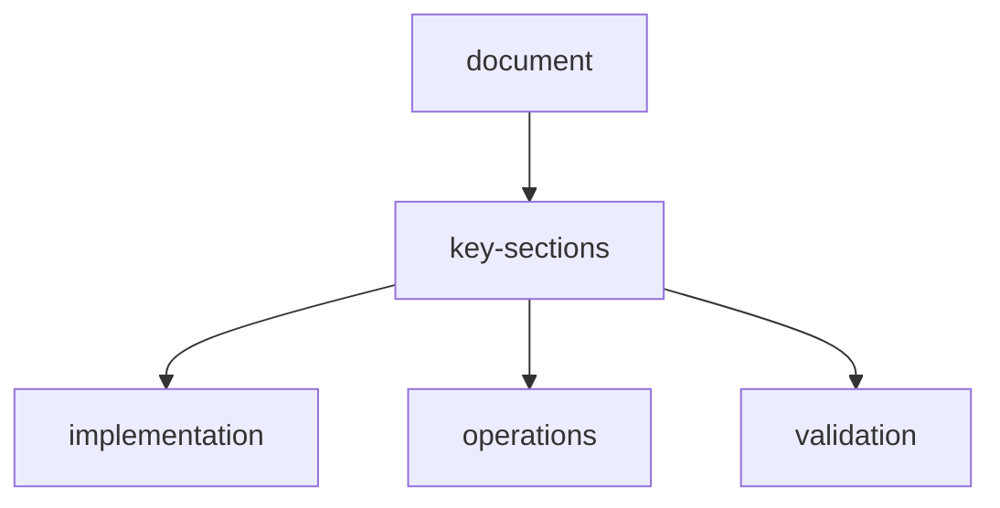

# real-curl-user-style-test-report-10-scenarios

## run-context
- Timestamp: `2026-04-04T23:08:19.953Z` (user-request window)
- Stack: `docker compose up --build -d`
- API base used for all calls: `http://localhost:3000/api`
- All requests executed with **`curl.exe`** (not mocked HTTP clients)

## curl-flow-used
```bash
curl.exe -sS -X POST "http://localhost:3000/api/scrape/" \
  -H "Content-Type: application/json" \
  --data-binary "@payload.json"

curl.exe -sS "http://localhost:3000/api/scrape/<session_id>/status"
curl.exe -sS "http://localhost:3000/api/scrape/<session_id>/result"
curl.exe -sS -X DELETE "http://localhost:3000/api/scrape/<session_id>/cleanup"
```

## example-real-request-payload
```json
{
  "session_id": "realcurl-cedd928b3d",
  "assets": ["https://example.com"],
  "instructions": "Extract page title, main summary, and top navigation links useful for a product snapshot.",
  "output_instructions": "Return strict JSON with keys: page_title, summary, links.",
  "output_format": "json",
  "complexity": "low",
  "provider": "nvidia",
  "model": "meta/llama-3.3-70b-instruct",
  "enable_memory": true,
  "enable_plugins": ["mcp-html"],
  "max_steps": 10
}
```

## test-matrix-10-10-real-requests
| # | Test | Provider / Model | Assets | Complexity | Format | Memory | Plugins | Final | Steps | Reward | Errors |
| --- | --- | --- | --- | --- | --- | --- | --- | --- | ---: | ---: | ---: |
| 1 | ecommerce-low-json | nvidia / meta/llama-3.3-70b-instruct | https://example.com | low | json | on | mcp-html | completed | 10 | 4.834 | 0 |
| 2 | docs-medium-markdown | nvidia / meta/llama-3.3-70b-instruct | https://www.python.org, https://docs.python.org/3/ | medium | markdown | on | mcp-search, skill-extractor | completed | 31 | 14.660 | 0 |
| 3 | research-high-json | nvidia / meta/llama-3.3-70b-instruct | https://www.wikipedia.org, https://www.nasa.gov | high | json | on | mcp-browser, skill-planner, proc-json | completed | 43 | 19.580 | 0 |
| 4 | support-low-csv | nvidia / meta/llama-3.3-70b-instruct | https://httpbin.org/html | low | csv | off | none | completed | 10 | 4.834 | 0 |
| 5 | jobs-medium-csv | nvidia / meta/llama-3.3-70b-instruct | https://github.com/trending, https://news.ycombinator.com | medium | csv | on | mcp-search, proc-csv | completed | 31 | 14.660 | 0 |
| 6 | policy-high-text | nvidia / meta/llama-3.3-70b-instruct | https://www.un.org | high | text | on | mcp-browser | completed | 22 | 9.790 | 0 |
| 7 | framework-low-markdown | nvidia / meta/llama-3.3-70b-instruct | https://www.djangoproject.com | low | markdown | on | mcp-html | completed | 10 | 4.834 | 0 |
| 8 | education-medium-json-groq | groq / llama-3.3-70b-versatile | https://www.python.org, https://www.wikipedia.org | medium | json | on | skill-navigator, skill-verifier | completed | 31 | 14.660 | 0 |
| 9 | science-high-csv | nvidia / meta/llama-3.3-70b-instruct | https://www.nasa.gov, https://docs.python.org/3/ | high | csv | off | mcp-html, proc-json | completed | 43 | 19.580 | 0 |
| 10 | legal-low-text | nvidia / meta/llama-3.3-70b-instruct | https://en.wikipedia.org/wiki/Terms_of_service | low | text | on | skill-planner | completed | 10 | 4.834 | 0 |

## aggregate-outcome
- Total tests: **10**
- Completed: **10**
- Partial: **0**
- Failed: **0**
- Total steps executed: **241** (avg **24.1** per test)
- Total reward: **112.266** (avg **11.227** per test)
- Total reported errors: **0**

## notes
- These were real curl-driven end-to-end requests with real URL assets and user-style instruction prompts.
- Response payloads completed cleanly across low/medium/high complexity, JSON/CSV/Markdown/Text output instructions, memory on/off, and mixed plugin sets.

## document-flow


## related-api-reference

| item | value |
| --- | --- |
| api-reference | `api-reference.md` |
