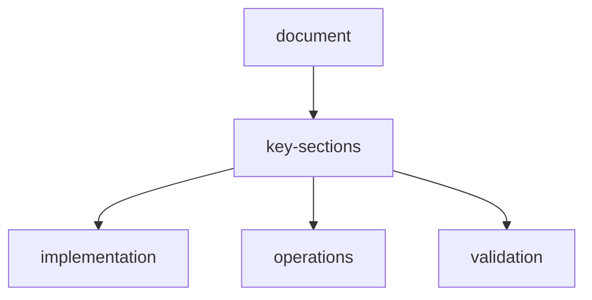

# site-template-matrix-test-report

**Date:** 2026-04-05  
**Scope:** Backend site-template registry, agent integration, and full template coverage tests

## summary

- Inbuilt templates expanded to **56 sites**
- Agents now load template context during planning/navigation
- New API surface added: `/api/sites`, `/api/sites/{site_id}`, `/api/sites/match`
- Full template test suite added and passing

## automated-tests

Command:

```bash
cd backend
python -m pytest tests/test_sites/test_registry.py tests/test_api/test_sites.py -q
```

Result:

- **11 passed**
- Coverage includes:
  - catalog size and uniqueness
  - domain matching for every template
  - navigation-plan site-template propagation for every template
  - API retrieval for every template
  - registry serialization completeness

## runtime-validation

### 1-template-catalog-endpoint

- `GET /api/sites`
- Result: `count = 56`

### 2-template-match-endpoint

- `POST /api/sites/match` with `https://reddit.com`
- Result: `matched = true`, `site_id = reddit`

### 3-agent-template-self-reference

Reddit scrape stream validation confirmed:

- `site_template` step emitted by navigator
- `planner_python.extracted_data.site_template_id = reddit`
- `navigator_python.extracted_data.site_template_id = reddit`

### 4-strategy-integration-checks

- Reddit request → `navigation_strategy = reddit_trending`
- GitHub trending request → `navigation_strategy = github_trending`
- Generic known domains (e.g., YouTube) → `site_template_id` populated, strategy-aware exploration

## folder-structure-additions

```text
backend/app/sites/
  __init__.py
  models.py
  templates.py
  registry.py

backend/tests/test_sites/
  test_registry.py
```

## notes

- Reddit direct endpoints are network-blocked in this environment; scraper uses fallback strategy while still preserving template-aware agent flow.
- Template-aware events are now visible in execution trace for debugging and orchestration transparency.


## related-api-reference

| item | value |
| --- | --- |
| api-reference | `api-reference.md` |

## document-metadata

| key | value |
| --- | --- |
| document | `test/site-template-matrix-report.md` |
| status | active |

## document-flow


