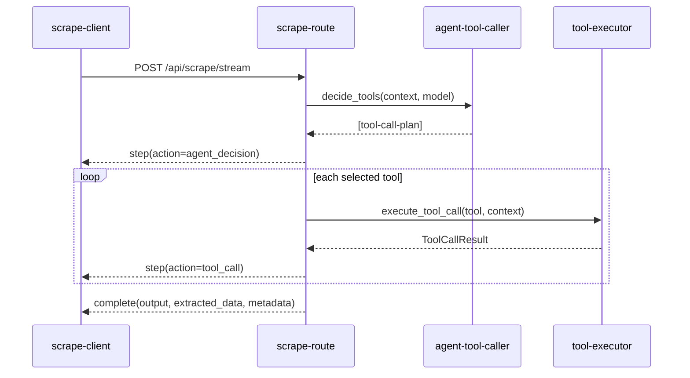

# tool-calls

## stream-event-overview

Tool calls are surfaced through scrape streaming events (`/api/scrape/stream`) as `step` payloads.

| event-type | purpose | contains-tool-call-data |
| --- | --- | --- |
| `init` | stream/session initialization | no |
| `url_start` | url processing started | no |
| `step` | progress/action update | yes (for `action=tool_call` and `action=agent_decision`) |
| `url_complete` | url processing complete | no |
| `complete` | final response payload | no (aggregated output only) |
| `error` | runtime error surface | optional |

## scrape-step-schema

`step` events are based on the `ScrapeStep` model.

| field | type | description |
| --- | --- | --- |
| `step_number` | integer | sequence index in the session |
| `action` | string | logical action type (`tool_call`, `agent_decision`, `plugins`, etc.) |
| `url` | string or null | active url for this step when available |
| `status` | string | runtime state (`running`, `complete`, `completed`, `failed`, etc.) |
| `message` | string | short human-readable step summary |
| `reward` | number | reward delta for this step |
| `extracted_data` | object or null | structured details, including tool payloads |
| `duration_ms` | number or null | optional elapsed time for the step |
| `timestamp` | string | utc iso timestamp |

## tool-call-payload-patterns

### pattern-a-registry-helper-calls

Used by `_create_tool_call_step(...)`.

| key-path | value-shape |
| --- | --- |
| `extracted_data.tool_name` | `namespace.action` |
| `extracted_data.tool_description` | short description |
| `extracted_data.parameters` | argument object |
| `extracted_data.result` | optional result object |

### pattern-b-runtime-agent-planner-and-executor

Used by dynamic runtime tool-calling in agentic scrape flow.

| action | key-path | value-shape |
| --- | --- | --- |
| `agent_decision` | `extracted_data.tool_calls[]` | `tool`, `params`, `reasoning` |
| `tool_call` | `extracted_data.tool` | selected tool name |
| `tool_call` | `extracted_data.success` | boolean execution state |
| `tool_call` | `extracted_data.result_preview` | compact serialized result |
| `tool_call` | `extracted_data.error` | error message if failed |
| `tool_call` | `extracted_data.duration_ms` | execution duration |

## runtime-tool-call-lifecycle



## field-order-and-rendering-guidance

Frontend and log consumers should parse structured fields, not message text.

| consumer-surface | recommendation |
| --- | --- |
| timeline ui | group by `action`, then read `extracted_data` keys |
| tool call panel | prefer `tool_name`/`tool` over `message` |
| analytics | aggregate by `tool_name`/`tool` and `success` |
| debugging | use `result_preview` and `error` first, full context second |

## example-step-events

```json
{
  "type": "step",
  "data": {
    "step_number": 17,
    "action": "agent_decision",
    "status": "completed",
    "message": "Agent selected 4 runtime tools",
    "reward": 0.1,
    "extracted_data": {
      "tool_calls": [
        {"tool": "html.select", "params": {"selector": "article", "limit": 20}, "reasoning": "Find repeated blocks"},
        {"tool": "extract.top_n", "params": {"n": 10}, "reasoning": "Apply output size cap"}
      ]
    },
    "timestamp": "2026-04-08T11:49:20.000000+00:00"
  }
}
```

```json
{
  "type": "step",
  "data": {
    "step_number": 18,
    "action": "tool_call",
    "status": "completed",
    "message": "Tool html.select: ok",
    "reward": 0.05,
    "extracted_data": {
      "tool": "html.select",
      "success": true,
      "result_preview": "{'elements_found': 12, 'selector_used': 'article'}",
      "error": null,
      "duration_ms": 3
    },
    "timestamp": "2026-04-08T11:49:20.005000+00:00"
  }
}
```

## troubleshooting-table

| symptom | likely-cause | check |
| --- | --- | --- |
| `agent_decision` absent | planner disabled or failed before plan emit | verify `live_llm_enabled` path and planner warnings |
| selected tools not executed | planner output filtered/empty | inspect selected tool names against registry |
| many failed tool calls | unsupported namespace or bad params | verify executor namespace handlers and args |
| output quality unchanged | tool observations not influencing extraction | verify `AGENT TOOL OBSERVATIONS` injected in extraction prompt |
## related-api-reference

| item | value |
| --- | --- |
| api-reference | `api-reference.md` |
