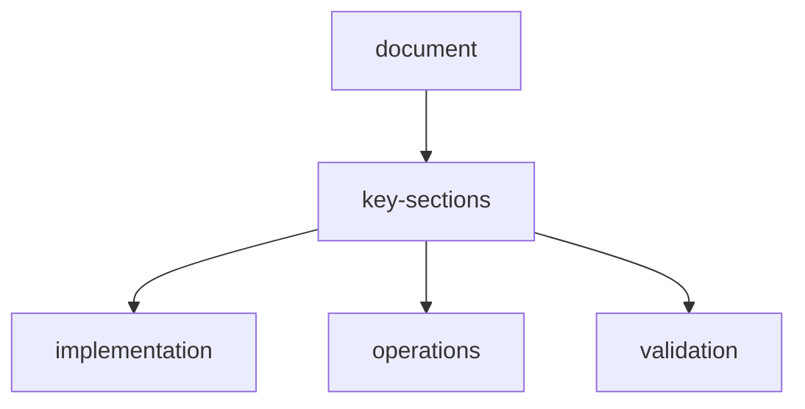

# scraperl-documentation

Welcome to ScrapeRL - an advanced Reinforcement Learning-powered web scraping environment. This documentation covers all aspects of using and configuring ScrapeRL.

---

## table-of-contents

1. [Getting Started](#getting-started)
2. [Dashboard Overview](#dashboard-overview)
3. [Agents](#agents)
4. [Plugins](#plugins)
5. [Memory System](#memory-system)
6. [Models & Providers](#models--providers)
7. [Settings](#settings)
8. [API Reference](#api-reference)
9. [Troubleshooting](#troubleshooting)

---

## getting-started

### what-is-scraperl

ScrapeRL is an intelligent web scraping system that uses Reinforcement Learning (RL) to learn and adapt scraping strategies. Unlike traditional scrapers, ScrapeRL can:

- **Learn from experience** - Improve scraping strategies over time
- **Adapt to changes** - Handle website structure changes automatically
- **Multi-agent coordination** - Use specialized agents for different tasks
- **Memory-enhanced** - Remember patterns and optimize future runs

### quick-start

1. **Enter a Target URL** - Provide the webpage you want to scrape
2. **Write an Instruction** - Describe what data you want to extract
3. **Configure Options** - Select model, agents, and plugins
4. **Start Episode** - Click Start and watch the magic happen!

### example-task

```
URL: https://example.com/products
Instruction: Extract all product names, prices, and descriptions
Task Type: Medium
```

---

## dashboard-overview

The dashboard is your command center for monitoring and controlling scraping operations.

### layout-structure

| Section | Description |
|---------|-------------|
| **Input Bar** | Enter URL, instruction, and configure task |
| **Left Sidebar** | View active agents, MCPs, skills, and tools |
| **Center Area** | Main visualization and current observation |
| **Right Sidebar** | Memory stats, extracted data, recent actions |
| **Bottom Logs** | Real-time terminal-style log output |

### stats-header

The header shows key metrics with expandable details:

- **Episodes** - Total scraping sessions completed
- **Steps** - Actions taken in current/total sessions
- **Reward** - Performance score (higher is better)
- **Time** - Current time and session duration

Click the **⋯** icon on any stat to see detailed statistics (min, max, average).

### task-configuration

#### task-types

| Type | Description | Use Case |
|------|-------------|----------|
|  **Low** | Simple single-page scraping | Product page, article text |
|  **Medium** | Multi-page with navigation | Search results, listings |
|  **High** | Complex interactive tasks | Login-required, forms |

---

## agents

ScrapeRL uses a multi-agent architecture where specialized agents handle different aspects of scraping.

### available-agents

| Agent | Role | Description |
|-------|------|-------------|
| **Coordinator** |  Orchestrator | Manages all other agents, decides strategy |
| **Scraper** |  Extractor | Extracts data from page content |
| **Navigator** |  Navigation | Handles page navigation, clicking, scrolling |
| **Analyzer** |  Analysis | Analyzes extracted data for patterns |
| **Validator** |  Validation | Validates data quality and completeness |

### agent-selection

1. Click the **Agents** button in the input bar
2. Select agents you want to enable
3. Active agents appear in the left sidebar accordion
4. Monitor agent activity in real-time

### agent-status-indicators

-  **Active** - Currently processing
-  **Ready** - Waiting for task
-  **Idle** - Not currently in use
-  **Error** - Encountered an issue

---

## plugins

Extend ScrapeRL's capabilities with plugins organized by category.

### plugin-categories

#### mcps-model-context-protocols

Tools that provide browser automation and page interaction:

| Plugin | Description |
|--------|-------------|
| Browser Use | AI-powered browser automation |
| Puppeteer MCP | Headless Chrome control |
| Playwright MCP | Cross-browser automation |

#### skills

Specialized capabilities for specific tasks:

| Plugin | Description |
|--------|-------------|
| Web Scraping | Core extraction algorithms |
| Data Extraction | Structured data parsing |
| Form Filling | Automated form completion |

#### apis

External service integrations:

| Plugin | Description |
|--------|-------------|
| Firecrawl | High-performance web crawler |
| Jina Reader | Content reader API |
| Serper | Search engine results API |

#### vision

Visual understanding capabilities:

| Plugin | Description |
|--------|-------------|
| GPT-4 Vision | OpenAI visual analysis |
| Gemini Vision | Google visual AI |
| Claude Vision | Anthropic visual models |

### managing-plugins

1. Go to **Plugins** tab
2. Browse by category
3. Click **Install** to add a plugin
4. Enable plugins in Dashboard via the Plugins popup

---

## memory-system

ScrapeRL uses a hierarchical memory system for context retention.

### memory-layers

| Layer | Purpose | Retention |
|-------|---------|-----------|
| **Working** | Current task context | Session |
| **Episodic** | Experience records | Persistent |
| **Semantic** | Learned patterns | Persistent |
| **Procedural** | Action sequences | Persistent |

### memory-features

- **Auto-consolidation** - Promotes important data between layers
- **Similarity search** - Find related memories quickly
- **Pattern recognition** - Learn from past experiences

---

## models-and-providers

### supported-providers

| Provider | Models | Best For |
|----------|--------|----------|
| **Groq** | GPT-OSS 120B | Fast inference, default |
| **Google** | Gemini 2.5 Flash | Balanced performance |
| **OpenAI** | GPT-4 Turbo | High accuracy |
| **Anthropic** | Claude 3 Opus | Complex reasoning |

### model-selection

1. Click **Model** button in input bar
2. Select from available models
3. Models require appropriate API keys

### api-keys

Configure API keys in **Settings > API Keys**:

1. Select provider
2. Enter your API key
3. Click Save
4. Key status shows as "Active" when configured

---

## settings

### general-settings

| Setting | Description |
|---------|-------------|
| WebSocket Updates | Enable real-time updates |
| Memory Persistence | Save memory across sessions |
| Auto-save Episodes | Automatically save completed episodes |
| Debug Mode | Enable verbose logging |

### budget-and-limits

Control API usage costs:

- **Daily Limit** - Maximum spend per day
- **Monthly Limit** - Maximum spend per month
- **Max Tokens** - Token limit per request
- **Alert Threshold** - Warning at 80% usage

>  Budget limits are disabled by default. Enable in Settings to control spending.

### appearance

- **Theme** - Dark (default), Light, Auto
- **Compact Mode** - Reduce UI spacing
- **Animations** - Enable/disable transitions

---

## api-reference

### health-check

```bash
GET /api/health
```

Response:
```json
{
  "status": "healthy",
  "version": "0.1.0",
  "timestamp": "2026-03-28T00:00:00Z"
}
```

### episode-management

```bash
# Start new episode
POST /api/episode/reset
{
  "task_id": "scrape-products",
  "config": { ... }
}

# Take action
POST /api/episode/step
{
  "action": "navigate",
  "params": { "url": "..." }
}

# Get current state
GET /api/episode/state
```

### memory-api

```bash
# Store entry
POST /api/memory/store
{
  "content": "...",
  "memory_type": "working",
  "metadata": { ... }
}

# Query memories
POST /api/memory/query
{
  "query": "product prices",
  "memory_type": "semantic",
  "limit": 10
}
```

### plugins-api

```bash
# List plugins
GET /api/plugins/

# Install plugin
POST /api/plugins/install
{ "plugin_id": "firecrawl" }

# Uninstall plugin
POST /api/plugins/uninstall
{ "plugin_id": "firecrawl" }
```

---

## troubleshooting

### common-issues

#### api-key-required-error

**Solution:** Configure at least one API key in Settings > API Keys

#### episode-not-starting

**Checklist:**
- [ ] Valid URL entered
- [ ] At least one agent selected
- [ ] API key configured
- [ ] System status shows "Online"

#### slow-performance

**Tips:**
- Use Groq for faster inference
- Reduce enabled plugins
- Lower task complexity if possible

#### memory-full

**Solution:** Clear memory layers in Settings > Advanced > Clear Cache

### getting-help

- Check the logs panel for error details
- View episode history for past issues
- Report bugs on GitHub

---

## keyboard-shortcuts

| Shortcut | Action |
|----------|--------|
| `Ctrl + Enter` | Start/Stop episode |
| `Ctrl + L` | Clear logs |
| `Ctrl + ,` | Open settings |
| `Escape` | Close popups |

---

## version-history

### v0-1-0-current

- Initial release
- Multi-agent architecture
- Plugin system
- Memory layers
- Dashboard with real-time monitoring

---

*Documentation last updated: March 2026*

*Built with  by NeerajCodz*

## document-flow


## related-api-reference

| item | value |
| --- | --- |
| api-reference | `api-reference.md` |
