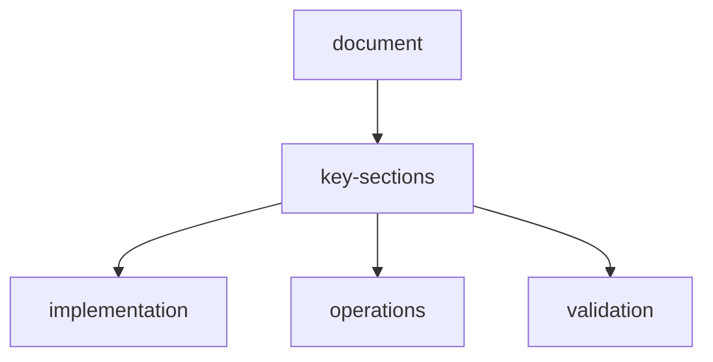

# webscraper-openenv-software-design-document

**Project:** WebScraper-OpenEnv  
**Version:** 1.0.0  
**Hackathon:** OpenEnv — Round 1  
**Author:** [Your Name]  
**Date:** March 2026  

---

## table-of-contents

1. [Project Overview](#1-project-overview)
2. [Real-World Motivation](#2-real-world-motivation)
3. [System Architecture](#3-system-architecture)
4. [OpenEnv Specification](#4-openenv-specification)
   - 4.1 Observation Model
   - 4.2 Action Model
   - 4.3 Reward Model
   - 4.4 Episode Lifecycle
5. [Environment State Machine](#5-environment-state-machine)
6. [Task Definitions](#6-task-definitions)
   - Task 1: Static Page Field Extraction (Easy)
   - Task 2: Paginated Catalog Scraping (Medium)
   - Task 3: Deep Research with Search & Fact Verification (Hard)
7. [Grader Design](#7-grader-design)
8. [Reward Function Design](#8-reward-function-design)
9. [Network Layer — VPN & Proxy](#9-network-layer--vpn--proxy)
   - 9.1 Architecture
   - 9.2 Proxy Configuration
   - 9.3 VPN Configuration
   - 9.4 Public Pool
   - 9.5 Settings Persistence
10. [API Endpoint Specification](#10-api-endpoint-specification)
11. [Data Models (Pydantic Schemas)](#11-data-models-pydantic-schemas)
12. [Simulated Web Environment](#12-simulated-web-environment)
13. [Baseline Inference Script](#13-baseline-inference-script)
14. [Project Structure](#14-project-structure)
15. [Dockerfile & Deployment](#15-dockerfile--deployment)
16. [openenv.yaml](#16-openenvyaml)
17. [Testing Strategy](#17-testing-strategy)
18. [Known Limitations & Future Work](#18-known-limitations--future-work)

---

## 1-project-overview

**WebScraper-OpenEnv** is a reinforcement learning environment that challenges AI agents to perform structured **web data extraction** — a task humans and automated pipelines carry out every day for market research, competitive intelligence, lead generation, price monitoring, and data journalism.

The environment wraps a fully **self-contained simulated web server** (no external network calls required) that presents realistic HTML pages with varying structure, noise, pagination, and adversarial anti-scraping patterns. Agents must issue targeted extraction actions to retrieve structured data within budget and quality constraints.

This environment is designed to:
- Evaluate an agent's ability to **parse and reason about semi-structured HTML**
- Test **multi-step planning** across paginated or linked content
- Stress-test **robustness** when pages are noisy, misleading, or rate-limited
- Provide **dense reward signals** that guide learning rather than just measuring final output

---

## 2-real-world-motivation

Web scraping is a core capability required across:

| Use Case | Example |
|---|---|
| E-commerce monitoring | Track competitor prices across 1,000 SKUs daily |
| Lead generation | Extract company names, emails, headcount from directories |
| Research automation | Aggregate paper titles, authors, abstracts from 5 sources |
| News intelligence | Collect headlines, dates, sources matching a keyword |
| Real estate | Pull property listings, prices, square footage from portals |

Current LLM agents struggle with scraping because it requires:
1. Selecting the right CSS/XPath selector or field label from noisy HTML
2. Knowing *when to stop* (pagination boundary detection)
3. Deduplication and normalization of extracted values
4. Graceful recovery from blocked or malformed pages

No existing OpenEnv environment covers this domain. **WebScraper-OpenEnv fills this gap.**

---

## 3-system-architecture

```
┌─────────────────────────────────────────────────────────────────┐
│                  Single Docker Container (:7860)                 │
│                                                                  │
│  ┌───────────────────────────────────────────────────────────┐  │
│  │                Vite Frontend (React)                       │  │
│  │   TaskSelector │ EpisodeViewer │ RewardChart │ Baseline   │  │
│  │                 fetch("/api/...")                          │  │
│  └────────────────────────┬──────────────────────────────────┘  │
│                            │ same origin                         │
│  ┌─────────────────────────▼────────────────────────────────┐   │
│  │                    FastAPI Application                    │   │
│  │                                                           │   │
│  │  /api/reset  /api/step  /api/state  /api/tasks           │   │
│  │  /api/grader  /api/baseline                              │   │
│  │  /*  → serves frontend/dist/index.html (SPA fallback)    │   │
│  │                                                           │   │
│  │  ┌──────────────────────┐  ┌──────────────────────────┐  │   │
│  │  │   WebScraperEnv      │  │    SimulatedWebServer    │  │   │
│  │  │  - episode state     │◄►│  - HTML page generator   │  │   │
│  │  │  - action dispatch   │  │  - pagination engine     │  │   │
│  │  │  - reward engine     │  │  - noise injector        │  │   │
│  │  │  - grader registry   │  │  - anti-scrape simulator │  │   │
│  │  └──────────────────────┘  └──────────────────────────┘  │   │
│  └───────────────────────────────────────────────────────────┘  │
└─────────────────────────────────────────────────────────────────┘
             ▲
             │  HTTP JSON  (agents / baseline script)
             ▼
      AI Agent / Baseline Script
```

**Key design decisions:**
- The simulated web server is **seeded and deterministic** — same `task_id` + `seed` always produces the same pages, enabling reproducible evaluation.
- Pages are generated dynamically from Jinja2 templates with injected noise, not stored as static files, keeping the Docker image small.
- The environment is **stateless across HTTP requests** but maintains episode state in-memory, keyed by `episode_id`.
- The **Vite frontend** is compiled at Docker build time (Stage 1) and served as static files by FastAPI — no separate web server (nginx, etc.) needed. Single port, single process.

---

## 4-openenv-specification

### 4-1-observation-model

An `Observation` is returned after every `reset()` and `step()` call.

```python
class Observation(BaseModel):
    episode_id: str              # UUID for the current episode
    task_id: str                 # Task identifier ("task_easy" | "task_medium" | "task_hard")
    step_number: int             # Current step count (0-indexed)
    current_url: str             # Simulated URL of the current page
    page_html: str               # Raw HTML content of the current page (trimmed to 8000 chars)
    page_title: str              # <title> tag value
    available_actions: list[str] # High-level action types available at this step
    extracted_so_far: dict       # Fields extracted successfully in this episode so far
    pages_visited: list[str]     # Ordered list of URLs visited this episode
    budget_remaining: int        # Remaining step budget (starts at task max_steps)
    task_description: str        # Human-readable task goal
    target_fields: list[str]     # Names of fields the agent must extract
    hints: list[str]             # Contextual hints (empty in hard mode)
```

**Design rationale:**
- `page_html` is included directly in the observation so agents can act without a separate fetch step. Truncated at 8,000 characters to simulate token budget pressure realistically.
- `extracted_so_far` gives the agent a running view of what it has already collected — critical for multi-page tasks.
- `hints` are populated for easy/medium tasks and empty for hard, creating a natural difficulty gradient.

### 4-2-action-model

An `Action` is submitted by the agent in each `step()` call.

```python
class Action(BaseModel):
    action_type: ActionType      # Enum — see below
    target_field: str | None     # Field name to extract (for EXTRACT actions)
    selector: str | None         # CSS selector or field label hint
    navigate_to: str | None      # URL or "next_page" / "prev_page" keyword
    submit_extraction: dict | None  # Final field→value map (for SUBMIT action)
    notes: str | None            # Agent's internal reasoning note (not scored, logged)
```

```python
class ActionType(str, Enum):
    EXTRACT_FIELD    = "extract_field"    # Extract one named field from current page
    NAVIGATE         = "navigate"         # Go to a URL or next/prev page
    SEARCH_PAGE      = "search_page"      # Regex/keyword search within current page HTML
    INSPECT_ELEMENT  = "inspect_element"  # Get focused text around a CSS selector
    SUBMIT           = "submit"           # Final answer — ends the episode
    SKIP_PAGE        = "skip_page"        # Declare current page irrelevant, move on
    # ── Task 3 / Hard mode only ─────────────────────────────────────────
    SEARCH_ENGINE    = "search_engine"    # Issue a query to the configured search engine
    VERIFY_FACT      = "verify_fact"      # Cross-check a field value against a second source
    RESOLVE_CONFLICT = "resolve_conflict" # Declare which of two conflicting values is authoritative
    FETCH_URL        = "fetch_url"        # Fetch an arbitrary URL (uses active proxy/VPN if set)
```

**Extended `Action` model for new types:**

```python
class Action(BaseModel):
    action_type: ActionType
    # --- Existing fields ---
    target_field: str | None     = None
    selector: str | None         = None
    navigate_to: str | None      = None
    submit_extraction: dict | None = None
    notes: str | None            = None
    # --- Search engine fields ---
    query: str | None            = None   # Query string for SEARCH_ENGINE
    search_engine: str | None    = None   # "google" | "bing" | "brave" | "ddg" (uses settings default if None)
    result_limit: int            = 5      # Max search results to return (1–10)
    # --- Fact verification fields ---
    field_name: str | None       = None   # Field to verify in VERIFY_FACT
    claimed_value: str | None    = None   # Value to check
    verification_source: str | None = None  # URL to verify against
    # --- Conflict resolution fields ---
    conflicting_sources: list[str] | None = None  # Two URLs with disagreeing values
    chosen_source: str | None    = None   # URL the agent judges more authoritative
    rationale: str | None        = None   # Agent's justification (logged, not scored)
```

**Design rationale:**
- Actions are **higher-level than raw HTTP** — the agent doesn't manage cookies or headers, it focuses on extraction logic.
- `INSPECT_ELEMENT` gives the agent a focused window into the DOM, rewarding agents that learn to select precisely.
- `SEARCH_ENGINE` issues a query through whichever engine the user has configured in Settings (or the environment's default). Results are returned as a ranked list of `{title, url, snippet}` objects — the agent then navigates to the most promising URL.
- `VERIFY_FACT` instructs the environment to fetch a second source and check whether the claimed value appears there. Returns a `verified: bool` and a `confidence: float` — not a definitive answer, mirroring real-world uncertainty.
- `RESOLVE_CONFLICT` is scored by the grader: if the agent picks the more authoritative source it earns a bonus; if it picks the wrong one it earns a penalty.
- `SUBMIT` is the terminal action that triggers the grader.

### 4-3-reward-model

```python
class Reward(BaseModel):
    value: float           # Reward for this step (-1.0 to +1.0)
    cumulative: float      # Total reward accumulated this episode
    breakdown: dict        # Labeled sub-rewards (for interpretability)
    message: str           # Human-readable explanation
```

### 4-4-episode-lifecycle

```
reset(task_id, seed?) 
  → Observation (step 0, fresh page, budget = max_steps)

step(action: EXTRACT_FIELD | NAVIGATE | ...) 
  → Observation (updated state), Reward, done=False, info

step(action: SUBMIT) 
  → Observation (terminal), Reward (grader score * scale), done=True, info

state() 
  → Current episode state snapshot (same fields as Observation + internal metadata)
```

An episode also ends automatically if:
- `budget_remaining` reaches 0 (budget exhaustion — scores whatever was extracted)
- The agent navigates to more than `max_pages` unique URLs

---

## 5-environment-state-machine

```
         reset()
            │
            ▼
    ┌──────────────┐
    │   RUNNING    │◄──────────────────────────────────────────┐
    │              │                                            │
    │  step(NAV)   │──► fetch_page()    ──► update_obs() ──────┤
    │  step(EXT)   │──► extract()       ──► update_obs() ──────┤
    │  step(SRCH)  │──► search_html()   ──► update_obs() ──────┤
    │  step(SE)    │──► search_engine() ──► ranked_results ────┤
    │  step(VRF)   │──► verify_fact()   ──► confidence_score ──┤
    │  step(RES)   │──► resolve()       ──► authoritative val ─┘
    └──────┬───────┘
           │
    step(SUBMIT) or budget=0
           │
           ▼
    ┌──────────────┐
    │   TERMINAL   │──► grader.score() ──► final Reward
    └──────────────┘
```

**State fields stored per episode:**

| Field | Type | Description |
|---|---|---|
| `episode_id` | str | UUID |
| `task_id` | str | Active task |
| `seed` | int | RNG seed for page generation |
| `step_number` | int | Steps taken |
| `current_url` | str | Active page URL |
| `pages_visited` | list | Navigation history |
| `extracted_data` | dict | Field→value map built up by agent |
| `ground_truth` | dict | Hidden correct field→value map |
| `budget` | int | Steps remaining |
| `status` | Enum | RUNNING / TERMINAL |
| `created_at` | datetime | Episode start time |

---

## 6-task-definitions

### task-1-static-page-field-extraction-easy

**ID:** `task_easy`  
**Max Steps:** 10  
**Max Pages:** 1  
**Hints:** Yes  

**Scenario:**  
The agent is given a single product listing page for an e-commerce store. The page contains a product name, price, SKU, star rating, and number of reviews. Minimal noise. Fields are labeled clearly.

**Target Fields:**
```
product_name, price, sku, star_rating, review_count
```

**Sample Page URL:** `sim://shop.example.com/product/42`

**Ground Truth (example, seeded):**
```json
{
  "product_name": "Wireless Noise-Cancelling Headphones",
  "price": "$89.99",
  "sku": "WNC-4421-BLK",
  "star_rating": "4.3",
  "review_count": "1,247"
}
```

**Success Criteria:**
- Extract all 5 fields correctly → score 1.0
- Partial credit per field (0.2 per field)
- Normalized comparison (whitespace-stripped, case-insensitive)

**Difficulty Rationale:** A capable LLM can find labeled fields in clean HTML in 1–3 steps with direct CSS selectors or simple keyword search.

---

### task-2-paginated-catalog-scraping-medium

**ID:** `task_medium`  
**Max Steps:** 25  
**Max Pages:** 5  
**Hints:** Partial (structure hint, no selector hint)  

**Scenario:**  
The agent must scrape a product catalog spread across 3 pages of pagination (20 items per page, 60 total items simulated). The agent must collect the **name and price of the 3 cheapest items** across all pages. Items are listed in random price order. The agent must decide whether to visit all pages or infer from partial data.

**Target Fields:**
```
cheapest_item_1_name, cheapest_item_1_price,
cheapest_item_2_name, cheapest_item_2_price,
cheapest_item_3_name, cheapest_item_3_price
```

**Complications introduced:**
- Prices use mixed formats: `$12.99`, `$12.990`, `12.99 USD` — normalization required
- One page contains a "Featured" item injected at the top that is actually overpriced
- Pagination links use non-obvious URL patterns (`?pg=2` vs `?offset=20`)

**Grader Logic:**
1. Extract agent's top-3 cheapest items
2. Compare to ground truth top-3 (computed by environment at episode start)
3. Score = (# correctly identified items / 3) × quality bonus (if price values match within ±$0.01)

**Difficulty Rationale:** Requires multi-page navigation planning, price normalization, and sorting logic — a significant step up from single-page extraction.

---

### task-3-deep-research-with-search-and-fact-verification-hard

**ID:** `task_hard`  
**Max Steps:** 60  
**Max Pages:** 20  
**Hints:** None  
**Search Engine:** Required (uses configured engine or environment default)  
**Fact Verification:** Required for minimum 3 fields to achieve full score  

---

**Scenario:**  
The agent is given a **target entity** (a mid-size private company, randomly selected per seed) and must build a fully sourced, verified intelligence profile. No starting URL is provided — the agent must begin by issuing search engine queries to discover relevant pages. Information is distributed across 6+ simulated domains and some fields only appear on pages that are only discoverable via search (not linked from the entry page). At least two fields will have conflicting values across sources, and the agent must explicitly resolve these conflicts to earn full credit.

---

**Target Fields (14 total, grouped by difficulty tier):**

```
── Tier 1 — Basic Identity (weight 1.0x each) ──────────────────────────
company_name              Full legal name of the company
headquarters_city         City of primary HQ
headquarters_country      Country of primary HQ
primary_industry          Top-level industry category (e.g. "FinTech", "SaaS")

── Tier 2 — Operational Data (weight 1.5x each) ────────────────────────
founding_year             Year company was founded  [CONFLICT present]
employee_count_range      Bucketed range: "1-50" | "51-200" | "201-500" | "501-2000" | "2000+"
ceo_name                  Full name of current CEO  [requires search to discover page]
product_count             Number of distinct products/services listed  [requires enumeration]

── Tier 3 — Financial & Strategic (weight 2.0x each) ───────────────────
latest_funding_round_type Series A/B/C | Seed | Growth | IPO | Unknown
latest_funding_amount_usd Numeric USD value (normalize: "$12M" → 12000000)
total_funding_usd         Cumulative raised (may require summing across rounds)  [CONFLICT present]
lead_investor             Name of lead investor in latest round  [search-only page]

── Tier 4 — Verification Required (weight 2.5x each) ───────────────────
founding_year_verified    Must call VERIFY_FACT; score only awarded if verified
ceo_name_verified         Must call VERIFY_FACT from a second independent source
```

---

**Complications introduced:**

**Search-first discovery**
No entry URL is provided. The agent must use `SEARCH_ENGINE` to find a homepage, news page, and financial data page. The simulated search engine returns ranked results with varying relevance — the top result is not always the most useful one.

**Cross-domain fragmentation**
Data is spread across 6 simulated domains. No single domain holds more than 4 fields. The agent must plan a visit sequence and track what it has found vs. what is still missing.

| Domain | Fields present |
|---|---|
| `sim://company.example.com` | company_name, headquarters_city/country, primary_industry |
| `sim://directory.example.com` | founding_year (version A), employee_count_range, ceo_name |
| `sim://news.example.com` | latest_funding_round_type, latest_funding_amount_usd, lead_investor |
| `sim://finance.example.com` | total_funding_usd, founding_year (version B — conflict), product_count |
| `sim://regulatory.example.com` | founding_year (authoritative — SEC-style filing, only discoverable via search) |
| `sim://linkedin-sim.example.com` | ceo_name (second independent source for verification) |

**Deliberate conflicts**
- `founding_year`: directory says 2011, finance page says 2013. The regulatory filing (search-only) says 2012 — this is the authoritative answer. Agent must issue `SEARCH_ENGINE` query to find it, then `RESOLVE_CONFLICT` naming it as authoritative.
- `total_funding_usd`: news page reports latest round only; finance page has cumulative. Agent must distinguish these and report cumulative.

**Prose extraction & normalization**
- `employee_count_range` appears as: "We have grown to over 800 people worldwide" → must map to `"501-2000"`
- `latest_funding_amount_usd` appears as: "raised $24.5 million in Series B" → must normalize to `24500000`
- `product_count` requires counting `<li>` items inside a specific section, not reading a single labeled field

**Simulated anti-scraping**
- `finance.example.com` returns a 429-like interstitial on the first visit; agent must either retry (costs a step) or configure a proxy/VPN in settings to bypass it
- `linkedin-sim.example.com` requires a `SEARCH_PAGE` keyword unlock before full content is accessible

**Verification gates**
Fields `founding_year_verified` and `ceo_name_verified` are only scoreable if the agent has issued a `VERIFY_FACT` action for them referencing a different domain than the one the value was originally extracted from. The grader checks the action log — extraction alone is not sufficient.

---

**Search Engine Behavior in Task 3:**

When the agent calls `SEARCH_ENGINE`, the simulated engine returns results structured as:

```json
{
  "query": "Acme Corp company profile",
  "results": [
    {
      "rank": 1,
      "title": "Acme Corp — Official Website",
      "url": "sim://company.example.com/about",
      "snippet": "Acme Corp is a leading SaaS platform headquartered in Austin..."
    },
    {
      "rank": 2,
      "title": "Acme Corp on Business Directory",
      "url": "sim://directory.example.com/acme-corp",
      "snippet": "Founded in 2011. 820 employees. CEO: Jane Doe..."
    }
  ],
  "total_results_simulated": 47,
  "engine_used": "brave"
}
```

The agent can call `SEARCH_ENGINE` up to **8 times** per episode without penalty. Beyond 8 calls, each additional search costs `-0.05` reward (diminishing returns signal).

---

**Grader Logic:**

```python
def score_task_hard(submission, ground_truth, episode_state):
    score = 0.0
    max_score = sum(FIELD_WEIGHTS.values())  # 26.0 total weighted points

    for field, weight in FIELD_WEIGHTS.items():
        agent_val = normalize(submission.get(field))
        truth_val = normalize(ground_truth[field])

        if field.endswith("_verified"):
            # Only award if agent issued a VERIFY_FACT for this field
            # referencing a different source than the extraction source
            verify_actions = [a for a in episode_state.action_log
                              if a.action_type == "verify_fact"
                              and a.field_name == field.replace("_verified", "")]
            cross_source = any(
                a.verification_source != episode_state.primary_source_for[field]
                for a in verify_actions
            )
            if agent_val == truth_val and cross_source:
                score += weight
            elif agent_val == truth_val:
                score += weight * 0.5  # Partial: correct but unverified
        elif field in CONFLICT_FIELDS:
            # Check agent issued RESOLVE_CONFLICT with correct authoritative source
            resolve_actions = [a for a in episode_state.action_log
                               if a.action_type == "resolve_conflict"
                               and field in str(a)]
            resolved_correctly = any(
                a.chosen_source == AUTHORITATIVE_SOURCE[field]
                for a in resolve_actions
            )
            if agent_val == truth_val and resolved_correctly:
                score += weight
            elif agent_val == truth_val:
                score += weight * 0.6  # Correct value but no explicit resolution
        else:
            if agent_val == truth_val:
                score += weight
            elif partial_match(agent_val, truth_val):
                score += weight * 0.4

    # Coverage bonus: +0.5 if all 14 fields present in submission (even if some wrong)
    coverage_bonus = 0.5 if len(submission) >= 14 else len(submission) / 14 * 0.5

    raw = (score / max_score) + (coverage_bonus / (max_score + 0.5))
    return min(raw, 1.0)
```

**Expected baseline scores:**

| Agent | Expected Score | Bottleneck |
|---|---|---|
| gpt-4o-mini (no tools) | ~0.20 | Cannot discover search-only pages |
| gpt-4o-mini + search | ~0.45 | Struggles with conflict resolution |
| gpt-4o (ReAct loop) | ~0.62 | Verification gate compliance |
| Human (manual) | ~0.90 | Benchmark ceiling |

**Difficulty Rationale:** This task is genuinely hard for frontier models because it requires: (1) search-first discovery with no entry URL, (2) multi-domain planning across 6 sources, (3) fact verification as a mandatory action class (not just extracting a value), (4) explicit conflict resolution with source authority reasoning, and (5) normalization of numeric and prose values. No single capability is sufficient — the agent must exercise all of them in one episode.

---

## 7-grader-design

Each task has a dedicated `Grader` class implementing the following interface:

```python
class BaseGrader(ABC):
    def score(
        self, 
        agent_submission: dict,   # The agent's SUBMIT payload
        ground_truth: dict,       # Hidden correct values
        episode_state: EpisodeState
    ) -> GraderResult:
        ...

class GraderResult(BaseModel):
    score: float                  # 0.0 – 1.0
    field_scores: dict[str, float] # Per-field breakdown
    feedback: str                 # Human-readable explanation
    penalty_applied: bool         # True if penalties were triggered
    penalty_reason: str | None
```

**Normalization Rules applied before comparison:**

| Field Type | Normalization |
|---|---|
| Price | Strip currency symbols, commas → float |
| Text | Strip whitespace, lowercase, remove punctuation |
| Number with commas | `"1,247"` → `1247` |
| Range | `"500-999"` bucketed comparison |
| Year | Integer comparison |

**Penalties:**
- If `step_number > max_steps * 0.8` and fewer than 50% fields extracted → efficiency penalty of -0.1
- If agent submits more than 3 times (SUBMIT + reset-less re-attempts) → repeat penalty of -0.05 per extra submit

**Determinism guarantee:** All graders use only the seeded `ground_truth` dict and the submitted dict. No randomness at score time.

---

## 8-reward-function-design

The reward function provides **dense signal across the full trajectory**, not just a terminal reward.

```
R_total = R_extraction + R_efficiency + R_navigation + R_terminal - R_penalty
```

### per-step-rewards

| Event | Reward | Rationale |
|---|---|---|
| `EXTRACT_FIELD` → correct value | +0.15 | Core task success signal |
| `EXTRACT_FIELD` → partially correct (wrong format, right content) | +0.05 | Encourages normalization learning |
| `EXTRACT_FIELD` → wrong value | -0.05 | Penalizes overconfident extraction |
| `EXTRACT_FIELD` → field already extracted | -0.10 | Penalizes redundant actions |
| `NAVIGATE` → new relevant page | +0.05 | Rewards exploration |
| `NAVIGATE` → already-visited page | -0.08 | Penalizes loops |
| `NAVIGATE` → irrelevant page (no target fields) | -0.03 | Soft penalty for bad routing |
| `SEARCH_PAGE` → finds target field hint | +0.03 | Rewards intelligent search |
| `SEARCH_PAGE` → no results | -0.01 | Small cost for wasted action |
| `INSPECT_ELEMENT` → valid selector hit | +0.02 | Rewards precision |
| `SKIP_PAGE` → page is actually irrelevant | +0.05 | Rewards correct relevance judgment |
| `SKIP_PAGE` → page contained target fields | -0.15 | Penalizes incorrect dismissal |
| `SEARCH_ENGINE` → query within 8-call budget | 0.00 | Neutral — search is a tool, not scored |
| `SEARCH_ENGINE` → discovers a new relevant domain | +0.08 | Rewards effective query formulation |
| `SEARCH_ENGINE` → call #9+ (over budget) | -0.05 | Diminishing returns signal |
| `VERIFY_FACT` → claimed value confirmed | +0.12 | Rewards verification behavior |
| `VERIFY_FACT` → claimed value contradicted | +0.08 | Still rewards checking (good epistemic practice) |
| `VERIFY_FACT` → verifying already-verified field | -0.05 | Penalizes redundant verification |
| `RESOLVE_CONFLICT` → correct authoritative source | +0.20 | High reward for correct reasoning |
| `RESOLVE_CONFLICT` → wrong authoritative source | -0.10 | Penalizes incorrect conflict resolution |
| `FETCH_URL` → returns useful content | +0.02 | Small reward for productive fetch |
| `FETCH_URL` → blocked (anti-scrape, no proxy set) | -0.03 | Mild penalty — should configure proxy |
| `FETCH_URL` → blocked (proxy active, retry succeeds) | +0.05 | Rewards using proxy correctly |
| Budget exhaustion (no SUBMIT) | -0.20 | Penalizes running out of budget |

### terminal-reward-on-submit

```
R_terminal = grader_score × 2.0
```

This scales the terminal reward to dominate the trajectory reward, ensuring the agent optimizes for final output quality.

### reward-range

- Minimum possible (all wrong, loops, budget exhausted): approximately -2.5
- Maximum possible (all correct, efficient path): approximately +2.5
- Typical good agent trajectory: +1.0 to +1.8

---

## 9-network-layer-vpn-and-proxy

The network layer is an optional but impactful system component. When active, all `NAVIGATE`, `FETCH_URL`, and `SEARCH_ENGINE` actions route outbound requests through the configured proxy or VPN. In simulation mode (default), the layer gates which simulated domains respond with 200 vs. 429 — giving agents a realistic incentive to configure networking.

---

### 9-1-architecture

```
Agent Action (FETCH_URL / NAVIGATE / SEARCH_ENGINE)
        │
        ▼
┌───────────────────────┐
│   NetworkRouter       │
│                       │
│  active_proxy? ──────►│──► requests.Session(proxies={...})
│  active_vpn?   ──────►│──► subprocess → wireguard/openvpn tunnel
│  neither       ──────►│──► direct (or blocked by anti-scrape sim)
└───────────────────────┘
        │
        ▼
  SimulatedWebServer / Real HTTP (if live mode enabled)
```

**Two operating modes:**

| Mode | Description | When used |
|---|---|---|
| `simulation` (default) | No real network; proxy/VPN settings control which simulated domains unblock | Always safe, deterministic, no credentials needed |
| `live` | Real HTTP requests routed through configured proxy/VPN | Optional; requires user-supplied credentials or public pool selection |

Mode is set in `Settings → Network → Mode`. `live` mode is off by default and requires explicit opt-in.

---

### 9-2-proxy-configuration

Proxies can be configured three ways: user-supplied credentials, a pre-tested public proxy pool, or disabled.

**Settings model:**

```python
class ProxyConfig(BaseModel):
    enabled: bool = False
    mode: Literal["custom", "public_pool", "rotating"] = "custom"

    # ── Custom proxy (user-supplied) ──────────────────────────────
    host: str | None            = None   # e.g. "proxy.mycompany.com"
    port: int | None            = None   # e.g. 8080
    protocol: Literal["http", "https", "socks4", "socks5"] = "http"
    username: str | None        = None   # Optional auth
    password: str | None        = None   # Stored encrypted at rest (Fernet)
    auth_scheme: Literal["basic", "digest", "ntlm"] = "basic"

    # ── Public pool (no credentials required) ────────────────────
    public_pool_provider: str | None = None  # "webshare" | "proxyscrape" | "openproxy"
    public_pool_country_filter: str | None = None  # ISO 3166-1 e.g. "US", "DE"

    # ── Rotating proxy ────────────────────────────────────────────
    rotating_endpoint: str | None = None  # e.g. "rotate.proxyservice.io:8080"
    rotate_every_n_requests: int  = 10

    # ── Validation ────────────────────────────────────────────────
    test_url: str = "http://httpbin.org/ip"
    last_test_result: str | None = None   # "ok" | "timeout" | "auth_failed"
    last_tested_at: datetime | None = None
```

**Proxy URL construction (internal):**

```python
def build_proxy_url(cfg: ProxyConfig) -> str:
    if cfg.username and cfg.password:
        return f"{cfg.protocol}://{cfg.username}:{cfg.password}@{cfg.host}:{cfg.port}"
    return f"{cfg.protocol}://{cfg.host}:{cfg.port}"
```

**Public pool providers (pre-configured, no credentials):**

| Provider key | Type | Notes |
|---|---|---|
| `webshare` | HTTP rotating | 10 free proxies on free tier |
| `proxyscrape` | HTTP/SOCKS5 scraped list | Refreshed every 15 min |
| `openproxy` | HTTP/HTTPS | Community maintained |

The environment ships with a static list of ~50 pre-validated public proxies for simulation mode. In live mode, lists are fetched fresh from provider APIs.

---

### 9-3-vpn-configuration

VPN integration supports **WireGuard** and **OpenVPN** protocols. Users paste their config file content or fill individual fields in the Settings UI.

```python
class VPNConfig(BaseModel):
    enabled: bool = False
    protocol: Literal["wireguard", "openvpn"] = "wireguard"

    # ── WireGuard ─────────────────────────────────────────────────
    wg_config_content: str | None  = None  # Full .conf file content (pasted in UI)
    wg_interface_name: str         = "wg0"

    # ── OpenVPN ───────────────────────────────────────────────────
    ovpn_config_content: str | None = None  # Full .ovpn file content
    ovpn_username: str | None       = None
    ovpn_password: str | None       = None  # Encrypted at rest

    # ── Common ────────────────────────────────────────────────────
    server_label: str | None       = None   # Human label e.g. "US East — NordVPN"
    kill_switch: bool              = True   # Block requests if tunnel drops
    last_test_result: str | None   = None
    last_connected_at: datetime | None = None
```

**VPN lifecycle (live mode):**

```
POST /api/settings/vpn/connect
  → writes temp config file
  → subprocess: wg-quick up wg0   OR   openvpn --daemon --config temp.ovpn
  → polls interface for IP change
  → stores connected_ip in session

POST /api/settings/vpn/disconnect
  → subprocess: wg-quick down wg0   OR   killall openvpn
  → clears connected_ip
```

In **simulation mode**, VPN is purely logical — activating it marks the session as "VPN active" which causes the simulated anti-scrape layer to allow all domain requests.

> **Docker note:** WireGuard and OpenVPN require `NET_ADMIN` and `SYS_MODULE` capabilities. The Dockerfile exposes these only if `ENABLE_LIVE_NETWORK=true` is set. HF Spaces deployment runs in simulation mode only (capabilities not available).

---

### 9-4-public-pool-quick-start

For users who don't have their own proxy or VPN, the Settings UI offers a **Public Pool** tab that requires zero configuration:

| Pool name | Protocol | Speed | Reliability | Notes |
|---|---|---|---|---|
| WebShare Free | HTTP rotating | Medium | High | Registration required (free) |
| ProxyScrape | HTTP/SOCKS5 | Variable | Medium | No registration |
| OpenProxy Space | HTTP/HTTPS | Slow | Low | Community pool, use as fallback |
| Simulation Bypass | Simulated | N/A | 100% | Always available; simulation only |

Selecting "Simulation Bypass" is the recommended option for evaluation runs — it unlocks all simulated anti-scrape gates without needing real network credentials.

---

### 9-5-settings-persistence

All network settings are stored server-side in a lightweight JSON config file (`config/network_settings.json`). Passwords and VPN configs are encrypted using **Fernet symmetric encryption** with a key derived from a server-side secret (`SETTINGS_SECRET` env var).

```python
class NetworkSettings(BaseModel):
    proxy: ProxyConfig   = ProxyConfig()
    vpn: VPNConfig       = VPNConfig()
    default_search_engine: Literal["google", "bing", "brave", "ddg"] = "brave"
    live_mode_enabled: bool = False
    request_timeout_seconds: int = 10
    max_retries: int = 3
    retry_backoff_factor: float = 1.5
    user_agent: str = "WebScraperOpenEnv/1.0"
```

The Settings UI reads from `GET /api/settings` and writes via `PUT /api/settings`. Passwords are never returned in GET responses — they are write-only from the UI's perspective.

---

## 10-api-endpoint-specification

All endpoints accept and return `application/json`.

### post-api-reset

Initialize or restart an episode.

**Request:**
```json
{ "task_id": "task_easy", "seed": 42 }
```
**Response:** `Observation` model

---

### post-api-step

Advance the episode by one action.

**Request:**
```json
{
  "episode_id": "uuid-...",
  "action": {
    "action_type": "extract_field",
    "target_field": "price",
    "selector": ".product-price"
  }
}
```
**Response:**
```json
{
  "observation": { "..." : "..." },
  "reward": { "value": 0.15, "cumulative": 0.15, "breakdown": {}, "message": "..." },
  "done": false,
  "info": { "step": 1, "budget_remaining": 9 }
}
```

---

### get-api-state

Return current episode state. **Query param:** `episode_id=uuid-...`

---

### get-api-tasks

Return all task definitions and their action schemas.

---

### post-api-grader

Score a completed episode.

**Request:**
```json
{
  "episode_id": "uuid-...",
  "submission": { "product_name": "...", "price": "..." }
}
```
**Response:** `GraderResult` model

---

### post-api-baseline

Trigger the built-in baseline inference script against all 3 tasks and return scores.

**Response:**
```json
{
  "baseline_model": "gpt-4o-mini",
  "results": {
    "task_easy":   { "score": 0.92, "steps": 4,  "fields_correct": 5  },
    "task_medium": { "score": 0.67, "steps": 18, "fields_correct": 4  },
    "task_hard":   { "score": 0.38, "steps": 54, "fields_correct": 8  }
  },
  "aggregate_score": 0.66,
  "run_id": "baseline-seed42"
}
```

---

### get-api-settings

Return current network settings. **Passwords are never returned** — password fields are always `null` in the response.

**Response:** `NetworkSettings` model (with password fields nulled)

---

### put-api-settings

Update network settings (full or partial).

**Request:** Partial `NetworkSettings` object — only provided fields are updated.

```json
{
  "proxy": {
    "enabled": true,
    "mode": "custom",
    "host": "proxy.example.com",
    "port": 8080,
    "protocol": "http",
    "username": "user",
    "password": "secret"
  }
}
```

---

### post-api-settings-proxy-test

Test the current proxy configuration by making a request to `test_url`.

**Response:**
```json
{
  "success": true,
  "exit_ip": "45.33.32.156",
  "latency_ms": 312,
  "error": null
}
```

---

### post-api-settings-vpn-connect

Activate the configured VPN tunnel (live mode only; simulation mode returns immediate success).

**Response:**
```json
{
  "connected": true,
  "tunnel_ip": "10.8.0.2",
  "exit_ip": "185.220.101.45",
  "protocol": "wireguard",
  "error": null
}
```

---

### post-api-settings-vpn-disconnect

Tear down the active VPN tunnel.

---

### get-api-settings-network-status

Returns current active network configuration — what proxy/VPN is live right now.

**Response:**
```json
{
  "proxy_active": true,
  "proxy_host": "proxy.example.com:8080",
  "vpn_active": false,
  "vpn_server": null,
  "exit_ip": "45.33.32.156",
  "live_mode": false,
  "default_search_engine": "brave"
}
```

---

### get-api-settings-public-pool

Returns the list of available public proxy/VPN pool options with current availability status.

**Response:**
```json
{
  "pools": [
    { "key": "simulation_bypass", "name": "Simulation Bypass", "available": true, "requires_auth": false },
    { "key": "webshare",          "name": "WebShare Free",      "available": true, "requires_auth": true  },
    { "key": "proxyscrape",       "name": "ProxyScrape",        "available": true, "requires_auth": false },
    { "key": "openproxy",         "name": "OpenProxy Space",    "available": true, "requires_auth": false }
  ]
}
```

---

## 11-data-models-pydantic-schemas

```python
# env/models.py

from pydantic import BaseModel, Field
from enum import Enum
from typing import Optional
import uuid

class ActionType(str, Enum):
    EXTRACT_FIELD   = "extract_field"
    NAVIGATE        = "navigate"
    SEARCH_PAGE     = "search_page"
    INSPECT_ELEMENT = "inspect_element"
    SUBMIT          = "submit"
    SKIP_PAGE       = "skip_page"

class Action(BaseModel):
    action_type: ActionType
    target_field: Optional[str] = None
    selector: Optional[str] = None
    navigate_to: Optional[str] = None
    submit_extraction: Optional[dict] = None
    notes: Optional[str] = None

class Observation(BaseModel):
    episode_id: str
    task_id: str
    step_number: int
    current_url: str
    page_html: str
    page_title: str
    available_actions: list[str]
    extracted_so_far: dict
    pages_visited: list[str]
    budget_remaining: int
    task_description: str
    target_fields: list[str]
    hints: list[str]

class Reward(BaseModel):
    value: float
    cumulative: float
    breakdown: dict[str, float]
    message: str

class GraderResult(BaseModel):
    score: float = Field(ge=0.0, le=1.0)
    field_scores: dict[str, float]
    feedback: str
    penalty_applied: bool
    penalty_reason: Optional[str] = None

class EpisodeState(BaseModel):
    episode_id: str
    task_id: str
    seed: int
    step_number: int
    current_url: str
    pages_visited: list[str]
    extracted_data: dict
    budget_remaining: int
    status: str  # "running" | "terminal"
    cumulative_reward: float
    created_at: str
    # Task 3 extras
    action_log: list[dict] = []        # Full action history for grader inspection
    search_calls_used: int = 0         # Track against 8-call free budget
    verified_fields: list[str] = []    # Fields that have passed VERIFY_FACT
    resolved_conflicts: list[str] = [] # Fields where RESOLVE_CONFLICT was issued

class SearchResult(BaseModel):
    rank: int
    title: str
    url: str
    snippet: str

class SearchEngineResponse(BaseModel):
    query: str
    results: list[SearchResult]
    total_results_simulated: int
    engine_used: str
    calls_remaining: int  # Free budget remaining (8 - used)

class VerifyFactResponse(BaseModel):
    field_name: str
    claimed_value: str
    verification_source: str
    verified: bool
    confidence: float  # 0.0 – 1.0
    supporting_text: str | None  # Excerpt from verification source
    contradicting_text: str | None

class NetworkStatus(BaseModel):
    proxy_active: bool
    proxy_host: Optional[str]
    vpn_active: bool
    vpn_server: Optional[str]
    exit_ip: Optional[str]
    live_mode: bool
    default_search_engine: str
```

---

## 12-simulated-web-environment

The `SimulatedWebServer` class generates HTML pages on-the-fly using Jinja2 templates seeded by a deterministic RNG.

### page-generator-pipeline

```
seed + task_id + url
        │
        ▼
  RNG (random.Random)
        │
        ▼
  Template Selector ──► Jinja2 template
        │
        ▼
  Data Populator (products / company profiles / etc.)
        │
        ▼
  Noise Injector ──► adds decoy elements, broken tags, ads
        │
        ▼
  Anti-Scrape Layer ──► conditionally adds interstitials (task_hard)
        │
        ▼
  HTML string (max 8,000 chars)
```

### noise-types-by-task

| Noise Type | Easy | Medium | Hard |
|---|---|---|---|
| Decoy fields with similar labels |  |  |  |
| Inconsistent price formatting |  |  |  |
| Broken/unclosed HTML tags |  |  |  |
| Interstitial blocking page |  |  |  |
| Contradictory values across pages |  |  |  |
| JavaScript-only content (noscript fallback) |  |  |  |
| Paginated content (multi-page) |  |  |  |

### url-scheme

Simulated URLs follow the pattern `sim://<domain>/<path>`. The environment maps these to page generators internally — no DNS or network calls occur.

```
sim://shop.example.com/product/42              → product page (task_easy)
sim://catalog.example.com/products?pg=1        → catalog page 1 of 3 (task_medium)
sim://company.example.com/about                → company homepage (task_hard)
sim://directory.example.com/org/acme           → directory listing (task_hard)
sim://news.example.com/search?q=acme           → news aggregator (task_hard)
sim://finance.example.com/ticker/ACME          → financial data (task_hard) ← 429 gate
sim://regulatory.example.com/filings/ACME      → SEC-style filing (task_hard, search-only)
sim://linkedin-sim.example.com/company/acme    → LinkedIn-style profile (task_hard, keyword gate)
```

**Anti-scrape simulation by domain:**

| Domain | Block type | Bypass method |
|---|---|---|
| `finance.example.com` | 429 Rate-limit on first visit | Retry after 1 step, or activate proxy |
| `linkedin-sim.example.com` | Keyword gate | `SEARCH_PAGE` with keyword "view_profile" |
| `regulatory.example.com` | Not linked — only discoverable via search | `SEARCH_ENGINE` with relevant query |

---

## 13-baseline-inference-script

`scripts/baseline.py` uses the OpenAI API to run a ReAct-style loop against the environment.

### agent-strategy

```
System Prompt:
  You are a web scraping agent. You will be given an HTML page and a list 
  of fields to extract. Use the available actions to extract all target 
  fields as efficiently as possible and then submit your findings.

Loop:
  1. Call /reset with task_id and seed=42
  2. While not done:
       a. Format observation as: current URL, page HTML (truncated), 
          fields still needed, steps remaining
       b. Prompt LLM for next action in JSON format
       c. Parse action → POST /step
       d. If done: record score
  3. Report all 3 task scores
```

### configuration

Read from environment variables:
```
OPENAI_API_KEY=...
BASELINE_MODEL=gpt-4o-mini     # default
BASELINE_SEED=42
BASELINE_MAX_RETRIES=3
```

### reproducibility

- Fixed seed=42 for all tasks
- Deterministic page generation
- Temperature=0 for LLM calls
- Results logged to `results/baseline_<timestamp>.json`

### expected-baseline-scores-gpt-4o-mini

| Task | Expected Score | Notes |
|---|---|---|
| task_easy | ~0.90 | Near-perfect on clean pages |
| task_medium | ~0.60 | Pagination handling is tricky |
| task_hard | ~0.35 | Multi-source coordination challenges |
| **Aggregate** | **~0.62** | |

---

## 14-project-structure

```
webscraper-openenv/
├── readme.md
├── openenv.yaml
├── Dockerfile
├── requirements.txt
│
├── frontend/                         # Vite + React app
│   ├── package.json
│   ├── vite.config.ts
│   ├── index.html
│   └── src/
│       ├── main.tsx
│       ├── App.tsx
│       ├── components/
│       │   ├── TaskSelector.tsx           # Pick task_easy / task_medium / task_hard
│       │   ├── EpisodeViewer.tsx          # Live observation display
│       │   ├── ActionPanel.tsx            # Manual action builder (for debugging)
│       │   ├── RewardChart.tsx            # Cumulative reward over steps
│       │   ├── BaselineRunner.tsx         # Trigger /api/baseline and show scores
│       │   └── settings/
│       │       ├── SettingsPage.tsx       # Top-level settings shell (tabbed layout)
│       │       ├── ProxySettings.tsx      # Proxy config form (custom / public pool / rotating)
│       │       ├── VPNSettings.tsx        # VPN config form (WireGuard / OpenVPN file paste)
│       │       ├── PublicPoolPicker.tsx   # Zero-config public proxy/VPN picker
│       │       ├── NetworkStatus.tsx      # Live badge: proxy active, VPN active, exit IP
│       │       └── SearchEngineSelector.tsx  # Default search engine picker
│       ├── hooks/
│       │   ├── useEpisode.ts             # Manages episode state via REST
│       │   ├── useNetworkSettings.ts     # Read/write /api/settings
│       │   └── useNetworkStatus.ts       # Polls /api/settings/network/status
│       └── api/
│           ├── client.ts                 # Typed fetch wrappers for all endpoints
│           └── settingsClient.ts         # Settings-specific API calls
│
├── env/
│   ├── __init__.py
│   ├── environment.py              # WebScraperEnv (step/reset/state)
│   ├── models.py                   # All Pydantic models
│   ├── reward.py                   # RewardEngine
│   ├── state.py                    # EpisodeState management
│   ├── tasks/
│   │   ├── task_easy.py
│   │   ├── task_medium.py
│   │   └── task_hard.py            # Includes search engine + verify + resolve logic
│   └── simulator/
│       ├── web_server.py
│       ├── page_generator.py
│       ├── search_engine.py        # SimulatedSearchEngine (ranked results by seed)
│       ├── fact_verifier.py        # FactVerifier (cross-source consistency check)
│       ├── noise_injector.py
│       └── templates/
│           ├── product.html
│           ├── catalog.html
│           ├── company.html
│           ├── directory.html
│           ├── news.html
│           ├── finance.html
│           ├── regulatory.html     # New: SEC-style filing page
│           └── linkedin_sim.html   # New: LinkedIn-style profile page
│
├── network/
│   ├── __init__.py
│   ├── router.py                   # NetworkRouter (proxy/VPN dispatch)
│   ├── proxy_manager.py            # ProxyManager (build URL, test, rotate)
│   ├── vpn_manager.py              # VPNManager (wg-quick / openvpn subprocess)
│   ├── public_pool.py              # PublicPoolFetcher (webshare, proxyscrape, openproxy)
│   └── settings_store.py          # Encrypted read/write of network_settings.json
│
├── config/
│   └── network_settings.json       # Persisted settings (passwords Fernet-encrypted)
│
├── api/
│   ├── __init__.py
│   ├── main.py                     # FastAPI app + static file mount
│   ├── routes/
│   │   ├── env_routes.py           # /api/reset, /api/step, /api/state, etc.
│   │   └── settings_routes.py      # /api/settings/*, /api/settings/vpn/*, etc.
│   └── schemas.py
│
├── scripts/
│   ├── baseline.py
│   └── validate.py
│
├── tests/
│   ├── test_environment.py
│   ├── test_graders.py
│   ├── test_reward.py
│   ├── test_task3_search.py        # Search engine + verify + resolve tests
│   ├── test_network.py             # Proxy/VPN config + routing tests
│   └── test_api.py
│
└── results/
    └── baseline_seed42.json
```

---

## 15-dockerfile-and-deployment

Everything ships in a **single Docker container**. The build is a two-stage process: Stage 1 compiles the Vite frontend into static files; Stage 2 installs the Python backend and copies the compiled frontend in. FastAPI then serves both the API and the frontend from port 7860.

### request-routing-single-port

```
Port 7860
    │
    ├── /api/*       → FastAPI routes (all OpenEnv endpoints)
    ├── /assets/*    → Vite static assets (JS, CSS, chunks)
    └── /*           → index.html (SPA catch-all, handled by FastAPI StaticFiles)
```

FastAPI mounts the Vite build output (`frontend/dist/`) as a `StaticFiles` directory and adds a catch-all `GET /{full_path}` route that returns `index.html` so client-side routing works correctly.

```python
# api/main.py (relevant additions)
from fastapi.staticfiles import StaticFiles
from fastapi.responses import FileResponse

app.mount("/assets", StaticFiles(directory="frontend/dist/assets"), name="assets")

@app.get("/{full_path:path}", include_in_schema=False)
async def spa_fallback(full_path: str):
    return FileResponse("frontend/dist/index.html")
```

All API routes are prefixed with `/api` to avoid collisions with the SPA router:
```
POST /api/reset
POST /api/step
GET  /api/state
GET  /api/tasks
POST /api/grader
POST /api/baseline
```

The Vite frontend calls `fetch("/api/...")` — no base URL configuration needed in production since everything is on the same origin.

---

### dockerfile-multi-stage

```dockerfile
# ── Stage 1: Build Vite frontend ──────────────────────────────────────
FROM node:20-slim AS frontend-builder

WORKDIR /frontend

COPY frontend/package.json frontend/package-lock.json ./
RUN npm ci

COPY frontend/ ./
RUN npm run build
# Output: /frontend/dist/


# ── Stage 2: Python backend + compiled frontend ────────────────────────
FROM python:3.11-slim

WORKDIR /app

# System packages:
#   wireguard-tools + iproute2  → wg-quick (live VPN, only used if ENABLE_LIVE_NETWORK=true)
#   openvpn                     → OpenVPN tunnel (same gate)
#   curl                        → proxy connectivity tests
RUN apt-get update && apt-get install -y --no-install-recommends \
    wireguard-tools \
    iproute2 \
    openvpn \
    curl \
  && rm -rf /var/lib/apt/lists/*

# Install Python dependencies
COPY requirements.txt .
RUN pip install --no-cache-dir -r requirements.txt

# Copy backend source
COPY env/     ./env/
COPY network/ ./network/
COPY api/     ./api/
COPY scripts/ ./scripts/
COPY results/ ./results/
COPY config/  ./config/
COPY openenv.yaml .

# Copy compiled frontend from stage 1
COPY --from=frontend-builder /frontend/dist ./frontend/dist

ENV PYTHONUNBUFFERED=1
ENV PORT=7860
# ENABLE_LIVE_NETWORK=false  → simulation mode (safe default, no NET_ADMIN needed)
# ENABLE_LIVE_NETWORK=true   → real proxy/VPN (requires --cap-add NET_ADMIN SYS_MODULE)
ENV ENABLE_LIVE_NETWORK=false
ENV SETTINGS_SECRET=changeme_generate_a_real_key_in_production

EXPOSE 7860

CMD ["uvicorn", "api.main:app", "--host", "0.0.0.0", "--port", "7860"]
```

**Live network mode (local only, not for HF Spaces):**
```bash
docker run -p 7860:7860 \
  --cap-add NET_ADMIN \
  --cap-add SYS_MODULE \
  --sysctl net.ipv4.conf.all.src_valid_mark=1 \
  -e ENABLE_LIVE_NETWORK=true \
  -e OPENAI_API_KEY=$OPENAI_API_KEY \
  -e SETTINGS_SECRET=$(openssl rand -hex 32) \
  webscraper-openenv
```

---

### requirements-txt

```
fastapi>=0.110.0
uvicorn[standard]>=0.29.0
pydantic>=2.6.0
jinja2>=3.1.3
openai>=1.20.0
pytest>=8.1.0
httpx>=0.27.0
aiofiles>=23.2.1       # FastAPI StaticFiles
cryptography>=42.0.0   # Fernet encryption for stored credentials
requests[socks]>=2.31.0  # SOCKS4/5 proxy support
```

During local development, Vite's dev server runs on `:5173` and the FastAPI backend runs on `:8000`. The proxy forwards all `/api` calls to avoid CORS issues:

```typescript
import { defineConfig } from 'vite'
import react from '@vitejs/plugin-react'

export default defineConfig({
  plugins: [react()],
  server: {
    proxy: {
      '/api': {
        target: 'http://localhost:8000',
        changeOrigin: true,
      }
    }
  }
})
```

In production (inside Docker), no proxy is needed — both frontend and backend are on port 7860.

---

### requirements-txt

```
fastapi>=0.110.0
uvicorn[standard]>=0.29.0
pydantic>=2.6.0
jinja2>=3.1.3
openai>=1.20.0
pytest>=8.1.0
httpx>=0.27.0
aiofiles>=23.2.1   # Required for FastAPI StaticFiles
```

---

### local-development-workflow

```bash
# Option A: Full Docker (production-identical)
docker build -t webscraper-openenv .
docker run -p 7860:7860 -e OPENAI_API_KEY=$OPENAI_API_KEY webscraper-openenv
# Visit: http://localhost:7860

# Option B: Split dev servers (fast iteration)
# Terminal 1 — backend
uvicorn api.main:app --reload --port 8000

# Terminal 2 — frontend
cd frontend && npm run dev
# Visit: http://localhost:5173 (proxies API to :8000)
```

### build-and-smoke-test

```bash
docker build -t webscraper-openenv .

# Smoke test the API
curl http://localhost:7860/api/tasks

# Smoke test the frontend is served
curl -s http://localhost:7860 | grep -q "<div id=\"root\">" && echo "Frontend OK"

# Full reset/step cycle
curl -X POST http://localhost:7860/api/reset \
     -H "Content-Type: application/json" \
     -d '{"task_id": "task_easy", "seed": 42}'
```

### hugging-face-spaces-deployment

The Space will be tagged with `openenv` and configured as:
- **SDK:** Docker
- **App port:** 7860
- **Secrets:** `OPENAI_API_KEY` set via HF Secrets UI
- No extra build steps needed — the Dockerfile handles `npm ci && npm run build` internally in Stage 1

---

## 15-openenv-yaml

```yaml
name: webscraper-openenv
version: "1.0.0"
description: >
  A web scraping environment where AI agents extract structured data
  from simulated HTML pages with varying complexity, pagination,
  and adversarial noise patterns.

author: "[Your Name]"
license: MIT

tags:
  - openenv
  - web-scraping
  - information-extraction
  - nlp
  - real-world

tasks:
  - id: task_easy
    name: "Static Page Field Extraction"
    difficulty: easy
    max_steps: 10
    description: "Extract 5 product fields from a single clean product page."

  - id: task_medium
    name: "Paginated Catalog Scraping"
    difficulty: medium
    max_steps: 25
    description: "Find the 3 cheapest items across 3 pages of a product catalog."

  - id: task_hard
    name: "Multi-Source Research Aggregation"
    difficulty: hard
    max_steps: 40
    description: "Aggregate a company profile from 4 different simulated web sources."

api:
  reset:   POST /reset
  step:    POST /step
  state:   GET  /state
  tasks:   GET  /tasks
  grader:  POST /grader
  baseline: POST /baseline

observation_space:
  type: structured
  fields:
    - page_html: string
    - current_url: string
    - extracted_so_far: object
    - budget_remaining: integer
    - target_fields: array

action_space:
  type: structured
  action_types:
    - extract_field
    - navigate
    - search_page
    - inspect_element
    - submit
    - skip_page

reward_range: [-2.5, 2.5]
episode_termination:
  - "SUBMIT action called"
  - "budget_remaining reaches 0"
```

---

## 16-testing-strategy

### unit-tests

**`test_graders.py`**
- Test each grader with perfect submission → expect score = 1.0
- Test each grader with empty submission → expect score = 0.0
- Test partial submissions → expect intermediate scores
- Test normalization edge cases (price formats, whitespace, encoding)

**`test_reward.py`**
- Correct extraction event → reward > 0
- Redundant extraction → reward < 0
- Navigation loop → cumulative negative reward
- SUBMIT with perfect answer → large positive reward

**`test_environment.py`**
- `reset()` returns clean state with step_number=0
- `state()` after 3 steps returns step_number=3
- Budget exhaustion terminates episode
- Same seed produces identical HTML

### integration-tests

**`test_api.py`**
- Full episode run via HTTP for each task
- `/baseline` endpoint completes without error
- `/grader` returns score in [0.0, 1.0]
- Invalid episode_id returns 404

### validation

```bash
openenv validate .
```

Expected: All checks pass, spec compliance confirmed.

---

## 17-known-limitations-and-future-work

| Limitation | Impact | Future Fix |
|---|---|---|
| HTML truncated to 8,000 chars | Very long pages lose content | Configurable window + scrolling action |
| No JavaScript rendering simulation | JS-heavy sites not fully modeled | Add iframe/shadow DOM simulation |
| Single in-memory episode store | Not horizontally scalable | Redis-backed episode store |
| English-only pages | Non-English scraping not tested | Multilingual page templates |
| Fixed set of 3 tasks | Limited evaluation breadth | Procedural task generation with task_level param |
| No rate limiting simulation in easy/medium | Less realistic for those tiers | Progressive rate limiting across difficulty |

---

*End of Software Design Document*

*WebScraper-OpenEnv — OpenEnv Round 1 Submission*

## document-flow


## related-api-reference

| item | value |
| --- | --- |
| api-reference | `api-reference.md` |
